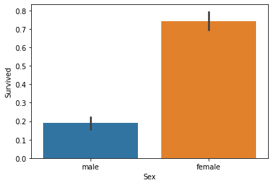
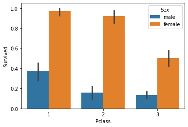
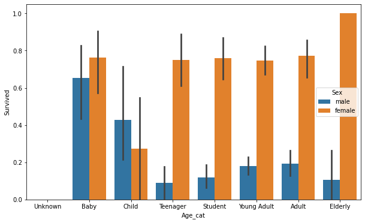

1. 지도학습 with labeled data 
- 분류(Classification)
    - 의사결정트리 DecisionTreeClassifier
- 회귀(Regression) 
    - 선형회귀 Linear Regression


```python
import pandas as pd
import numpy as np
```

Chapter 01 | 파이썬 기반의 머신러닝과 생태계 이해
======


```python
titanic_df = pd.read_csv("train.csv")
#titanic_df.describe()
titanic_df.head()
```


<div>
<style scoped>
    .dataframe tbody tr th:only-of-type {
        vertical-align: middle;
    }

    .dataframe tbody tr th {
        vertical-align: top;
    }

    .dataframe thead th {
        text-align: right;
    }
</style>
<table border="1" class="dataframe">
  <thead>
    <tr style="text-align: right;">
      <th></th>
      <th>PassengerId</th>
      <th>Survived</th>
      <th>Pclass</th>
      <th>Name</th>
      <th>Sex</th>
      <th>Age</th>
      <th>SibSp</th>
      <th>Parch</th>
      <th>Ticket</th>
      <th>Fare</th>
      <th>Cabin</th>
      <th>Embarked</th>
    </tr>
  </thead>
  <tbody>
    <tr>
      <th>0</th>
      <td>1</td>
      <td>0</td>
      <td>3</td>
      <td>Braund, Mr. Owen Harris</td>
      <td>male</td>
      <td>22.0</td>
      <td>1</td>
      <td>0</td>
      <td>A/5 21171</td>
      <td>7.2500</td>
      <td>NaN</td>
      <td>S</td>
    </tr>
    <tr>
      <th>1</th>
      <td>2</td>
      <td>1</td>
      <td>1</td>
      <td>Cumings, Mrs. John Bradley (Florence Briggs Th...</td>
      <td>female</td>
      <td>38.0</td>
      <td>1</td>
      <td>0</td>
      <td>PC 17599</td>
      <td>71.2833</td>
      <td>C85</td>
      <td>C</td>
    </tr>
    <tr>
      <th>2</th>
      <td>3</td>
      <td>1</td>
      <td>3</td>
      <td>Heikkinen, Miss. Laina</td>
      <td>female</td>
      <td>26.0</td>
      <td>0</td>
      <td>0</td>
      <td>STON/O2. 3101282</td>
      <td>7.9250</td>
      <td>NaN</td>
      <td>S</td>
    </tr>
    <tr>
      <th>3</th>
      <td>4</td>
      <td>1</td>
      <td>1</td>
      <td>Futrelle, Mrs. Jacques Heath (Lily May Peel)</td>
      <td>female</td>
      <td>35.0</td>
      <td>1</td>
      <td>0</td>
      <td>113803</td>
      <td>53.1000</td>
      <td>C123</td>
      <td>S</td>
    </tr>
    <tr>
      <th>4</th>
      <td>5</td>
      <td>0</td>
      <td>3</td>
      <td>Allen, Mr. William Henry</td>
      <td>male</td>
      <td>35.0</td>
      <td>0</td>
      <td>0</td>
      <td>373450</td>
      <td>8.0500</td>
      <td>NaN</td>
      <td>S</td>
    </tr>
  </tbody>
</table>
</div>


```python
value_counts = titanic_df['Pclass'].value_counts()
print(value_counts)  # only defined by series Q1.시리즈의 인덱스틑 어떻게 추출?
print(value_counts.index) # A1(pp.57:index객체)
```

    3    491
    1    216
    2    184
    Name: Pclass, dtype: int64
    Int64Index([3, 1, 2], dtype='int64')


```python
titanic_pclass = titanic_df['Pclass']
# print(titanic_pclass)
# print(type(titanic_pclass))
titanic_pclass.head()
```


    0    3
    1    1
    2    3
    3    1
    4    3
    Name: Pclass, dtype: int64


```python
titanic_df['Age_0']=0
#titanic_df.head(3)
titanic_df['Age_by_10']=titanic_df['Age']*10
titanic_df['Family_No']=titanic_df['SibSp']+titanic_df['Parch']+1
titanic_df.head(3)
```


<div>
<style scoped>
    .dataframe tbody tr th:only-of-type {
        vertical-align: middle;
    }

    .dataframe tbody tr th {
        vertical-align: top;
    }

    .dataframe thead th {
        text-align: right;
    }
</style>
<table border="1" class="dataframe">
  <thead>
    <tr style="text-align: right;">
      <th></th>
      <th>PassengerId</th>
      <th>Survived</th>
      <th>Pclass</th>
      <th>Name</th>
      <th>Sex</th>
      <th>Age</th>
      <th>SibSp</th>
      <th>Parch</th>
      <th>Ticket</th>
      <th>Fare</th>
      <th>Cabin</th>
      <th>Embarked</th>
      <th>Age_0</th>
      <th>Age_by_10</th>
      <th>Family_No</th>
    </tr>
  </thead>
  <tbody>
    <tr>
      <th>0</th>
      <td>1</td>
      <td>0</td>
      <td>3</td>
      <td>Braund, ...</td>
      <td>male</td>
      <td>22.0</td>
      <td>1</td>
      <td>0</td>
      <td>A/5 21171</td>
      <td>7.2500</td>
      <td>NaN</td>
      <td>S</td>
      <td>0</td>
      <td>220.0</td>
      <td>2</td>
    </tr>
    <tr>
      <th>1</th>
      <td>2</td>
      <td>1</td>
      <td>1</td>
      <td>Cumings,...</td>
      <td>female</td>
      <td>38.0</td>
      <td>1</td>
      <td>0</td>
      <td>PC 17599</td>
      <td>71.2833</td>
      <td>C85</td>
      <td>C</td>
      <td>0</td>
      <td>380.0</td>
      <td>2</td>
    </tr>
    <tr>
      <th>2</th>
      <td>3</td>
      <td>1</td>
      <td>3</td>
      <td>Heikkine...</td>
      <td>female</td>
      <td>26.0</td>
      <td>0</td>
      <td>0</td>
      <td>STON/O2....</td>
      <td>7.9250</td>
      <td>NaN</td>
      <td>S</td>
      <td>0</td>
      <td>260.0</td>
      <td>1</td>
    </tr>
  </tbody>
</table>
</div>


```python
drop_result = titanic_df.drop(['Age_0','Age_by_10','Family_No'], axis=1, inplace=True)
print('inplace=False로 drop 후 반환된 값 : ', drop_result)
titanic_df.head(3)
```

    inplace=False로 drop 후 반환된 값 :  None


<div>
<style scoped>
    .dataframe tbody tr th:only-of-type {
        vertical-align: middle;
    }

    .dataframe tbody tr th {
        vertical-align: top;
    }

    .dataframe thead th {
        text-align: right;
    }
</style>
<table border="1" class="dataframe">
  <thead>
    <tr style="text-align: right;">
      <th></th>
      <th>PassengerId</th>
      <th>Survived</th>
      <th>Pclass</th>
      <th>Name</th>
      <th>Sex</th>
      <th>Age</th>
      <th>SibSp</th>
      <th>Parch</th>
      <th>Ticket</th>
      <th>Fare</th>
      <th>Cabin</th>
      <th>Embarked</th>
    </tr>
  </thead>
  <tbody>
    <tr>
      <th>0</th>
      <td>1</td>
      <td>0</td>
      <td>3</td>
      <td>Braund, ...</td>
      <td>male</td>
      <td>22.0</td>
      <td>1</td>
      <td>0</td>
      <td>A/5 21171</td>
      <td>7.2500</td>
      <td>NaN</td>
      <td>S</td>
    </tr>
    <tr>
      <th>1</th>
      <td>2</td>
      <td>1</td>
      <td>1</td>
      <td>Cumings,...</td>
      <td>female</td>
      <td>38.0</td>
      <td>1</td>
      <td>0</td>
      <td>PC 17599</td>
      <td>71.2833</td>
      <td>C85</td>
      <td>C</td>
    </tr>
    <tr>
      <th>2</th>
      <td>3</td>
      <td>1</td>
      <td>3</td>
      <td>Heikkine...</td>
      <td>female</td>
      <td>26.0</td>
      <td>0</td>
      <td>0</td>
      <td>STON/O2....</td>
      <td>7.9250</td>
      <td>NaN</td>
      <td>S</td>
    </tr>
  </tbody>
</table>
</div>


```python
pd.set_option('display.width', 1000)
pd.set_option('display.max_colwidth', 12)
print('### before axis 0 drop ###')
print(titanic_df.head(3))
print('### after axis 0 drop ###')
drop = titanic_df.drop([0,1,2], axis=0, inplace=False)
print(drop)
```

    ### before axis 0 drop ###
       PassengerId  Survived  Pclass         Name     Sex   Age  SibSp  Parch       Ticket     Fare Cabin Embarked
    0            1         0       3  Braund, ...    male  22.0      1      0    A/5 21171   7.2500   NaN        S
    1            2         1       1  Cumings,...  female  38.0      1      0     PC 17599  71.2833   C85        C
    2            3         1       3  Heikkine...  female  26.0      0      0  STON/O2....   7.9250   NaN        S
    ### after axis 0 drop ###
         PassengerId  Survived  Pclass         Name     Sex   Age  SibSp  Parch      Ticket     Fare Cabin Embarked
    3              4         1       1  Futrelle...  female  35.0      1      0      113803  53.1000  C123        S
    4              5         0       3  Allen, M...    male  35.0      0      0      373450   8.0500   NaN        S
    5              6         0       3  Moran, M...    male   NaN      0      0      330877   8.4583   NaN        Q
    6              7         0       1  McCarthy...    male  54.0      0      0       17463  51.8625   E46        S
    7              8         0       3  Palsson,...    male   2.0      3      1      349909  21.0750   NaN        S
    ..           ...       ...     ...          ...     ...   ...    ...    ...         ...      ...   ...      ...
    886          887         0       2  Montvila...    male  27.0      0      0      211536  13.0000   NaN        S
    887          888         1       1  Graham, ...  female  19.0      0      0      112053  30.0000   B42        S
    888          889         0       3  Johnston...  female   NaN      1      2  W./C. 6607  23.4500   NaN        S
    889          890         1       1  Behr, Mr...    male  26.0      0      0      111369  30.0000  C148        C
    890          891         0       3  Dooley, ...    male  32.0      0      0      370376   7.7500   NaN        Q
    
    [888 rows x 12 columns]


```python
## pp.64
data = {'Name' : ['Chulmin', 'Eunkyung', 'Jinwoong', 'Soobeom'],
       'Year' : [2011, 2016, 2015, 2015],
       'Gender' : ['Male', 'Female', 'Male', 'Male']
       }

data_df = pd.DataFrame(data, index=['one', 'two', 'three', 'four'])
data_df
```


<div>
<style scoped>
    .dataframe tbody tr th:only-of-type {
        vertical-align: middle;
    }

    .dataframe tbody tr th {
        vertical-align: top;
    }

    .dataframe thead th {
        text-align: right;
    }
</style>
<table border="1" class="dataframe">
  <thead>
    <tr style="text-align: right;">
      <th></th>
      <th>Name</th>
      <th>Year</th>
      <th>Gender</th>
    </tr>
  </thead>
  <tbody>
    <tr>
      <th>one</th>
      <td>Chulmin</td>
      <td>2011</td>
      <td>Male</td>
    </tr>
    <tr>
      <th>two</th>
      <td>Eunkyung</td>
      <td>2016</td>
      <td>Female</td>
    </tr>
    <tr>
      <th>three</th>
      <td>Jinwoong</td>
      <td>2015</td>
      <td>Male</td>
    </tr>
    <tr>
      <th>four</th>
      <td>Soobeom</td>
      <td>2015</td>
      <td>Male</td>
    </tr>
  </tbody>
</table>
</div>


```python
## Boolean Indexting (pp.72)
titanic_df = pd.read_csv('train.csv')
titanic_boolean = titanic_df[titanic_df['Age']>60]
#titanic_boolean
# titanic_boolean[['Name', 'Age']].head(3) ## over 2 columns : [[]]
# titanic_boolean.loc[:,['Name', 'Age']].head(3)
# titanic_df.loc[titanic_df['Age']>60, ['Name', 'Age']].head(3)
titanic_df[(titanic_df['Age']>60) & (titanic_df['Pclass']==1) & (titanic_df['Sex']=='female')]
```


<div>
<style scoped>
    .dataframe tbody tr th:only-of-type {
        vertical-align: middle;
    }

    .dataframe tbody tr th {
        vertical-align: top;
    }

    .dataframe thead th {
        text-align: right;
    }
</style>
<table border="1" class="dataframe">
  <thead>
    <tr style="text-align: right;">
      <th></th>
      <th>PassengerId</th>
      <th>Survived</th>
      <th>Pclass</th>
      <th>Name</th>
      <th>Sex</th>
      <th>Age</th>
      <th>SibSp</th>
      <th>Parch</th>
      <th>Ticket</th>
      <th>Fare</th>
      <th>Cabin</th>
      <th>Embarked</th>
    </tr>
  </thead>
  <tbody>
    <tr>
      <th>275</th>
      <td>276</td>
      <td>1</td>
      <td>1</td>
      <td>Andrews, Miss. Kornelia Theodosia</td>
      <td>female</td>
      <td>63.0</td>
      <td>1</td>
      <td>0</td>
      <td>13502</td>
      <td>77.9583</td>
      <td>D7</td>
      <td>S</td>
    </tr>
    <tr>
      <th>829</th>
      <td>830</td>
      <td>1</td>
      <td>1</td>
      <td>Stone, Mrs. George Nelson (Martha Evelyn)</td>
      <td>female</td>
      <td>62.0</td>
      <td>0</td>
      <td>0</td>
      <td>113572</td>
      <td>80.0000</td>
      <td>B28</td>
      <td>NaN</td>
    </tr>
  </tbody>
</table>
</div>


```python
## Sort/Aggregation/Group-by (pp.75)
titanic_sorted = titanic_df.sort_values(by=['Pclass','Name'],ascending=False)
# titanic_df[['Age', 'Fare']].mean()
titanic_groupby = titanic_df.groupby(by='Pclass')
# titanic_groupby.count()
data = {'Passengers': titanic_groupby['PassengerId'].count(),
       'Age' : titanic_groupby['Age'].mean(),
        'Survived' : titanic_groupby['Survived'].mean(),
        'Fare' : titanic_groupby['Fare'].mean()
 }
Practice = pd.DataFrame(data)
# Practice
# titanic_groupby = titanic_df.groupby('Pclass')[['PassengerId','Survived']].count()
# titanic_groupby = titanic_df.groupby('Pclass')[['PassengerId']].count()
# titanic_groupby

# titanic_df.groupby('Pclass')['Age'].agg([max, min])
agg_format = {'PassengerId':'count', 'Survived':'mean','Age':'mean', 'Fare':'mean'}
titanic_df.groupby('Pclass').agg(agg_format)
```


<div>
<style scoped>
    .dataframe tbody tr th:only-of-type {
        vertical-align: middle;
    }

    .dataframe tbody tr th {
        vertical-align: top;
    }

    .dataframe thead th {
        text-align: right;
    }
</style>
<table border="1" class="dataframe">
  <thead>
    <tr style="text-align: right;">
      <th></th>
      <th>PassengerId</th>
      <th>Survived</th>
      <th>Age</th>
      <th>Fare</th>
    </tr>
    <tr>
      <th>Pclass</th>
      <th></th>
      <th></th>
      <th></th>
      <th></th>
    </tr>
  </thead>
  <tbody>
    <tr>
      <th>1</th>
      <td>216</td>
      <td>0.629630</td>
      <td>38.233441</td>
      <td>84.154687</td>
    </tr>
    <tr>
      <th>2</th>
      <td>184</td>
      <td>0.472826</td>
      <td>29.877630</td>
      <td>20.662183</td>
    </tr>
    <tr>
      <th>3</th>
      <td>491</td>
      <td>0.242363</td>
      <td>25.140620</td>
      <td>13.675550</td>
    </tr>
  </tbody>
</table>
</div>


```python
## Missing Data (pp.79)
titanic_df.isna()
titanic_df.isna().sum()
```


    PassengerId      0
    Survived         0
    Pclass           0
    Name             0
    Sex              0
    Age            177
    SibSp            0
    Parch            0
    Ticket           0
    Fare             0
    Cabin          687
    Embarked         2
    dtype: int64


```python
titanic_df['Cabin'].fillna('C000', inplace=True)
titanic_df['Age'].fillna(titanic_df['Age'].mean(), inplace=True)
titanic_df['Embarked'].fillna('S', inplace=True)
titanic_df.isna().sum()
```


    PassengerId    0
    Survived       0
    Pclass         0
    Name           0
    Sex            0
    Age            0
    SibSp          0
    Parch          0
    Ticket         0
    Fare           0
    Cabin          0
    Embarked       0
    dtype: int64


```python
## Apply Lambda (pp.82)
titanic_df['Name_len'] = titanic_df['Name'].apply(lambda x : len(x))
titanic_df[['Name','Name_len']]

titanic_df['Child_Adult'] = titanic_df['Age'].apply(lambda x : 'Child' if x<=15 else 'Adult')
titanic_df[['Age', 'Child_Adult']]

titanic_df['Age_Cat'] = titanic_df['Age'].apply(lambda x : 'Child' if x<=15 else ('Adult' if x<=60 else 'Elderly'))
titanic_df['Age_Cat'].value_counts()
```


    Adult      786
    Child       83
    Elderly     22
    Name: Age_Cat, dtype: int64


```python
def get_category(age):
    cat = ''
    if age<=5 : cat='Baby'
    elif age<=12 : cat='Child'
    elif age<=18 : cat='Teenager'
    elif age<=25 : cat ='Student'
    elif age<=35 : cat = 'Young Adult'
    elif age<=60 : cat = 'Adult'
    else : cat ='Elderly'
    return cat

titanic_df['Age_Cat'] = titanic_df['Age'].apply(lambda x : get_category(x))
titanic_df[['Age', 'Age_Cat']].head()
titanic_df['Age_Cat'].value_counts()
```


    Young Adult    373
    Adult          195
    Student        162
    Teenager        70
    Baby            44
    Child           25
    Elderly         22
    Name: Age_Cat, dtype: int64


# Chapter 02 | 사이킷런으로 시작하는 머신러닝

## 01. 사이킷런 (scikit-learn, sklearn)
- sklearn.datasets : 데이터세트 생성 모듈 모임
- sklearn.tree : 트리기반 ML 알고리즘 클래스 모임
- sklearn.model_selection : 학습/검증/예측 데이터 분리 및 평가 모듈의 모임

cf. 하이퍼 파라미터
머신러닝 알고니즘별로 최적의 학습을 위해 직접 입력하는 파라미터들을 통칭, 알고리즘의 성능을 튜닝

## 02. 붓꽃 품종 예측하기


```python
import sklearn

from sklearn.datasets import load_iris
from sklearn.tree import DecisionTreeClassifier # 머신러닝 분류 알고리즘 '의사결정트리클래스'
from sklearn.model_selection import train_test_split

import pandas as pd
iris = load_iris()
# sns.load_dataset("iris")
```


```python
print(dir(iris))
print(load_iris().keys())

# data : 데이터 가져오기
print(iris.data[:5])
print(type(iris.data)) 
print()

# feature 레이블 가져오기
print(iris.feature_names)
print(type(iris.feature_names)) 
print()

# filepath & filename 가져오기
print(iris.filename)
print()

# ???
print(iris.frame)
print()

# 분류할 카데고리 데이터 가져오기
print(iris.target)
print()

# 분류할 카테고리 이름 가져오기
print(iris.target_names)
print(type(iris.target_names))

```

    ['DESCR', 'data', 'feature_names', 'filename', 'frame', 'target', 'target_names']
    dict_keys(['data', 'target', 'frame', 'target_names', 'DESCR', 'feature_names', 'filename'])
    [[5.1 3.5 1.4 0.2]
     [4.9 3.  1.4 0.2]
     [4.7 3.2 1.3 0.2]
     [4.6 3.1 1.5 0.2]
     [5.  3.6 1.4 0.2]]
    <class 'numpy.ndarray'>
    
    ['sepal length (cm)', 'sepal width (cm)', 'petal length (cm)', 'petal width (cm)']
    <class 'list'>
    
    /opt/anaconda3/lib/python3.8/site-packages/sklearn/datasets/data/iris.csv
    
    None
    
    [0 0 0 0 0 0 0 0 0 0 0 0 0 0 0 0 0 0 0 0 0 0 0 0 0 0 0 0 0 0 0 0 0 0 0 0 0
     0 0 0 0 0 0 0 0 0 0 0 0 0 1 1 1 1 1 1 1 1 1 1 1 1 1 1 1 1 1 1 1 1 1 1 1 1
     1 1 1 1 1 1 1 1 1 1 1 1 1 1 1 1 1 1 1 1 1 1 1 1 1 1 2 2 2 2 2 2 2 2 2 2 2
     2 2 2 2 2 2 2 2 2 2 2 2 2 2 2 2 2 2 2 2 2 2 2 2 2 2 2 2 2 2 2 2 2 2 2 2 2
     2 2]
    
    ['setosa' 'versicolor' 'virginica']
    <class 'numpy.ndarray'>


```python
iris_data = iris.data

# ['sepal length (cm)', 'sepal width (cm)', 'petal length (cm)', 'petal width (cm)']
iris_label = iris.target 

iris_df = pd.DataFrame(data=iris_data, columns=iris.feature_names)
iris_df["label"] = iris.target
iris_df
```


<div>
<style scoped>
    .dataframe tbody tr th:only-of-type {
        vertical-align: middle;
    }

    .dataframe tbody tr th {
        vertical-align: top;
    }

    .dataframe thead th {
        text-align: right;
    }
</style>
<table border="1" class="dataframe">
  <thead>
    <tr style="text-align: right;">
      <th></th>
      <th>sepal length (cm)</th>
      <th>sepal width (cm)</th>
      <th>petal length (cm)</th>
      <th>petal width (cm)</th>
      <th>label</th>
    </tr>
  </thead>
  <tbody>
    <tr>
      <th>0</th>
      <td>5.1</td>
      <td>3.5</td>
      <td>1.4</td>
      <td>0.2</td>
      <td>0</td>
    </tr>
    <tr>
      <th>1</th>
      <td>4.9</td>
      <td>3.0</td>
      <td>1.4</td>
      <td>0.2</td>
      <td>0</td>
    </tr>
    <tr>
      <th>2</th>
      <td>4.7</td>
      <td>3.2</td>
      <td>1.3</td>
      <td>0.2</td>
      <td>0</td>
    </tr>
    <tr>
      <th>3</th>
      <td>4.6</td>
      <td>3.1</td>
      <td>1.5</td>
      <td>0.2</td>
      <td>0</td>
    </tr>
    <tr>
      <th>4</th>
      <td>5.0</td>
      <td>3.6</td>
      <td>1.4</td>
      <td>0.2</td>
      <td>0</td>
    </tr>
    <tr>
      <th>...</th>
      <td>...</td>
      <td>...</td>
      <td>...</td>
      <td>...</td>
      <td>...</td>
    </tr>
    <tr>
      <th>145</th>
      <td>6.7</td>
      <td>3.0</td>
      <td>5.2</td>
      <td>2.3</td>
      <td>2</td>
    </tr>
    <tr>
      <th>146</th>
      <td>6.3</td>
      <td>2.5</td>
      <td>5.0</td>
      <td>1.9</td>
      <td>2</td>
    </tr>
    <tr>
      <th>147</th>
      <td>6.5</td>
      <td>3.0</td>
      <td>5.2</td>
      <td>2.0</td>
      <td>2</td>
    </tr>
    <tr>
      <th>148</th>
      <td>6.2</td>
      <td>3.4</td>
      <td>5.4</td>
      <td>2.3</td>
      <td>2</td>
    </tr>
    <tr>
      <th>149</th>
      <td>5.9</td>
      <td>3.0</td>
      <td>5.1</td>
      <td>1.8</td>
      <td>2</td>
    </tr>
  </tbody>
</table>
<p>150 rows × 5 columns</p>
</div>


#### 데이터셋 분류 
- 레이블된 데이터셋이 한정되어 있을 때 훈련할 데이터와 테스트할 데이터를 분리시킴

| |훈련|테스트|비고|
|---|---|---|---|
|__정보__|X_train|X_test|sepal/petal_length/width| 
|__예측__|y_train|y_test|0(setosa), 1(versicolor), 2(virginica)|


```python
X_train, X_test, y_train, y_test = train_test_split(iris_data, iris_label, test_size=0.2, random_state=11)
# random_state:난수 발생 고정 = seed
```

- DecisionTree 객체 할당 및 학습 수행


```python
tree = DecisionTreeClassifier(random_state=11) # random_state:동일한 학습/예측 결과 출력
tree.fit(X_train, y_train)

```


    DecisionTreeClassifier(random_state=11)


- 예측 수행


```python
pred = tree.predict(X_test)
```

- 성능 평가
- 정확도 : 맞힌 갯수/테스트 데이터 갯수


```python
from sklearn.metrics import accuracy_score
accuracy_score(y_test, pred)
```


    0.9333333333333333


## summary
1. 데이터 세트 분리   
```
    train_test_split(data, label, test_size, random_state)
```

2. 모델 학습
* 객체 생성
```
    DecisionTreeClassifer(random_state)
```
* 학습 수행
```
    fit(train_set)
```

3. 예측 수행
```
    predict(test_data)
```

4. 평가
```
    accuracy_score(test_label, predict)
    

## 03. 사이킷런의 기반 프레임워크 익히기

- Estimator : 지도학습의 모든 알고리즘을 구현한 클래스
    - 메서드 
        - fit()
        - predict()

    - Estimator를 인자로 받는 함수들
        - cross_val_score() : 평가 함수
        - GridSearchCV() : 하이퍼 파라미터 튜닝을 지원하는 클래스 
        
        
- 비지도학습인 차원 축소, 클러스터링, 피처 추출 등을 구현한 클래스
    - 메서드
        - fit() : 입력 데이터 형태에 맞춰 데이터를 변환하기 위해 사전 구조를 맞추는 작업으로 지도학습에서의 fit()과는 차이가 있다.  *데이터 전처리? 같은 느낌인가?*   
        - transform() : 차원 축소, 클러스터링, 피처 추출 등 실제 작업
        - fit_transform() = fit() + transform() but, 사용에 주의 필요!
        - predict()
        
### 사이킷런의 주요 모듈
p.94

### 내장된 예제 데이터 세트
p. 96


## 04. Model Selection 모듈 소개
학습/테스트 데이터 세트 분리, 교차 검증 분할 및 평가, Estimator의 파라미터 튜닝을 위한 함수와 클래스 제공
### train_test_split()
1. [test] 학습/테스트 데이터 세트를 분리하지 않았을 때
    - 결과 : 정확도 100%
    - 이유 : 학습한 데이터 기반으로 테스트하였기 때문에


```python
from sklearn.datasets import load_iris
from sklearn.tree import DecisionTreeClassifier
from sklearn.metrics import accuracy_score

iris = load_iris()
tree = DecisionTreeClassifier()

train_data = iris.data
train_label = iris.target

tree.fit(train_data, train_label)

pred = tree.predict(train_data)
accuracy_score(train_label, pred)

```


    1.0


#### train_test_split() 속성
- test_size : 전체 데이터 중 테스트 데이터 세트로 얼마나 나눌 것인가(default=0.25)
- train_size : 
- shuffle : 분리하기 전에 데이터를 미리 섞을지, 데이터 분산시켜 효율적인 학습/테스트 데이터 세트 생성 (default=True)
- random_state : 동일한 학습/테스트용 데이터 세트를 생성하기 위해서 주어지는 난수값, 값을 지정해주지 않으면 수행할 때마다 다른 학습/테스트용 데이터를 생성
- 반환값 : tuple (학습용/테스트용 피처 데이터 세트, 학습용/테스트용 레이블 데이터 세트)


2. 학습/테스트 데이터 세트를 분리하기


```python
from sklearn.tree import DecisionTreeClassifier
from sklearn.metrics import accuracy_score
from sklearn.datasets import load_iris
from sklearn.model_selection import train_test_split

tree = DecisionTreeClassifier()

iris = load_iris()
iris_data = iris.data
iris_target = iris.target

X_train,X_test, y_train, y_test = train_test_split(iris_data, iris_label, test_size=0.3, random_state=121)

tree.fit(X_train, y_train)
pred = tree.predict(X_test)
accuracy_score(y_test, pred)

```


    0.9555555555555556


### 교차 검증

고정된 학습 데이터와 테스트 데이터로 평가하다보면 테스트 데이터에만 최적의 성능을 발휘하고 새로운 데이터에 대한 예측 성능이 과도하게 떨어지는 과적합(overfitting)이 발생할 수 있다. 이러한 문제점을 개선하기 위해 여러 세트로 구성된 학습 데이터와 검증 데이터 세트에서 학습과 평가를 진행하는 __교차 검증__ 을 이용한다. 테스트 데이터로 예측하기 전에 1차적으로 평가하는 것이다. 각 세트에서 수행한 결과에 따라서 하이퍼 파라미터 튜닝 등 모델 최적화를 더욱 손쉽게 할 수 있다. 

## K 폴드 교차 검증
K 개의 데이터 폴드 세트를 만들어서 K 번만큼 각 폴드 세트에 학습과 검증 평가를 반복적으로 수행
- KFold, StratifiedKFold 클래스 사용

#### 5 폴드 교차 검증


```python

from sklearn.datasets import load_iris
from sklearn.tree import DecisionTreeClassifier
from sklearn.metrics import accuracy_score
from sklearn.model_selection import train_test_split, KFold
import numpy as np

iris = load_iris()
features = iris.data
label = iris.target
tree = DecisionTreeClassifier(random_state=156)

# KFold 객체 생성
kfold = KFold(n_splits=5)
cv_accuracy = []
print("데이터셋 크기 :", features.shape[0])

```

    데이터셋 크기 : 150


```python
n_iter = 0

# KFold 객체의 split() 호출하면 홀드별 학습용, 검증용 테스트의 로우 인덱스를 array로 반환
for train_index, test_index in kfold.split(features):
    
    # kfold.split()으로 반환된 인덱스를 이용해 학습용, 검증용 테스트 데이터 추출
    X_train, X_test = features[train_index], features[test_index]
    y_train, y_test = label[train_index], label[test_index]
    
    # 학습 및 예측
    tree.fit(X_train, y_train)
    pred = tree.predict(X_test)
    n_iter += 1
    
    # 반복할 때마다 정확도 측정
    acc = np.round(accuracy_score(y_test, pred),4)
    train_size = X_train.shape[0]
    test_size = X_test.shape[0]
    
    cv_accuracy.append(acc)
    
    print("{}. 정확도 : {}, 학습데이터 크기 : {}, 검증데이터 크기 : {}".format(n_iter,acc, train_size, test_size))
    print("{}. 검증 세트 인덱스 : {}".format(n_iter, test_index))
    print()
    
print("평균 검증 정확도 : %.5f"%np.mean(cv_accuracy))  
```

    1. 정확도 : 1.0, 학습데이터 크기 : 120, 검증데이터 크기 : 30
    1. 검증 세트 인덱스 : [ 0  1  2  3  4  5  6  7  8  9 10 11 12 13 14 15 16 17 18 19 20 21 22 23
     24 25 26 27 28 29]
    
    2. 정확도 : 0.9667, 학습데이터 크기 : 120, 검증데이터 크기 : 30
    2. 검증 세트 인덱스 : [30 31 32 33 34 35 36 37 38 39 40 41 42 43 44 45 46 47 48 49 50 51 52 53
     54 55 56 57 58 59]
    
    3. 정확도 : 0.8667, 학습데이터 크기 : 120, 검증데이터 크기 : 30
    3. 검증 세트 인덱스 : [60 61 62 63 64 65 66 67 68 69 70 71 72 73 74 75 76 77 78 79 80 81 82 83
     84 85 86 87 88 89]
    
    4. 정확도 : 0.9333, 학습데이터 크기 : 120, 검증데이터 크기 : 30
    4. 검증 세트 인덱스 : [ 90  91  92  93  94  95  96  97  98  99 100 101 102 103 104 105 106 107
     108 109 110 111 112 113 114 115 116 117 118 119]
    
    5. 정확도 : 0.7333, 학습데이터 크기 : 120, 검증데이터 크기 : 30
    5. 검증 세트 인덱스 : [120 121 122 123 124 125 126 127 128 129 130 131 132 133 134 135 136 137
     138 139 140 141 142 143 144 145 146 147 148 149]
    
    평균 검증 정확도 : 0.90000


## Stratified K 폴드

예) 대출 사기 데이터 예측 모델  
- 1억건의 데이터 세트 중, 대출 사기 여부를 뜻하는 레이블(사기:1, 정상:0)이 1(사기)인 데이터가 약 1000건. 
- 전체의 0.0001% 매우 작은 확률로 대출 사기 레이블이 존재.  
- K폴드로 랜덤하게 학습 및 테스트 세트의 인덱스를 고르더라고 레이블 값인 0과 1의 비율을 제대로 반영하지 못하는 경우가 발생.  
- 1000건씩 나눈다면 사기 데이터가 많을수도 아예 없을 수도 있다. 이럴 경우 모집합의 비율(0.0001%)를 제대로 반영하지 못함.
- 대출 사기 레이블이 1인 데이터는 비록 건수는 작지만 대출 사기를 예측하기 위해서는 매우 중요한 피처 값을 가짐.
- 따라서 대출 사기 레이블 값의 분포를 학습 및 테스트 세트에서도 유지하는게 중요.


```python
import pandas as pd

iris = load_iris()
iris_df = pd.DataFrame(data=iris.data, columns=iris.feature_names)
iris_df["label"] = iris.target 
# iris_df["label"].value_counts()
iris_df
```


<div>
<style scoped>
    .dataframe tbody tr th:only-of-type {
        vertical-align: middle;
    }

    .dataframe tbody tr th {
        vertical-align: top;
    }

    .dataframe thead th {
        text-align: right;
    }
</style>
<table border="1" class="dataframe">
  <thead>
    <tr style="text-align: right;">
      <th></th>
      <th>sepal length (cm)</th>
      <th>sepal width (cm)</th>
      <th>petal length (cm)</th>
      <th>petal width (cm)</th>
      <th>label</th>
    </tr>
  </thead>
  <tbody>
    <tr>
      <th>0</th>
      <td>5.1</td>
      <td>3.5</td>
      <td>1.4</td>
      <td>0.2</td>
      <td>0</td>
    </tr>
    <tr>
      <th>1</th>
      <td>4.9</td>
      <td>3.0</td>
      <td>1.4</td>
      <td>0.2</td>
      <td>0</td>
    </tr>
    <tr>
      <th>2</th>
      <td>4.7</td>
      <td>3.2</td>
      <td>1.3</td>
      <td>0.2</td>
      <td>0</td>
    </tr>
    <tr>
      <th>3</th>
      <td>4.6</td>
      <td>3.1</td>
      <td>1.5</td>
      <td>0.2</td>
      <td>0</td>
    </tr>
    <tr>
      <th>4</th>
      <td>5.0</td>
      <td>3.6</td>
      <td>1.4</td>
      <td>0.2</td>
      <td>0</td>
    </tr>
    <tr>
      <th>...</th>
      <td>...</td>
      <td>...</td>
      <td>...</td>
      <td>...</td>
      <td>...</td>
    </tr>
    <tr>
      <th>145</th>
      <td>6.7</td>
      <td>3.0</td>
      <td>5.2</td>
      <td>2.3</td>
      <td>2</td>
    </tr>
    <tr>
      <th>146</th>
      <td>6.3</td>
      <td>2.5</td>
      <td>5.0</td>
      <td>1.9</td>
      <td>2</td>
    </tr>
    <tr>
      <th>147</th>
      <td>6.5</td>
      <td>3.0</td>
      <td>5.2</td>
      <td>2.0</td>
      <td>2</td>
    </tr>
    <tr>
      <th>148</th>
      <td>6.2</td>
      <td>3.4</td>
      <td>5.4</td>
      <td>2.3</td>
      <td>2</td>
    </tr>
    <tr>
      <th>149</th>
      <td>5.9</td>
      <td>3.0</td>
      <td>5.1</td>
      <td>1.8</td>
      <td>2</td>
    </tr>
  </tbody>
</table>
<p>150 rows × 5 columns</p>
</div>


```python
# 3개의 폴드 세트 구성
kfold = KFold(n_splits=3)

n_iter = 0
for train_index, test_index in kfold.split(features): # iris_df 
    
    n_iter += 1
    label_train = iris_df['label'].iloc[train_index]
    label_test = iris_df['label'].iloc[test_index]
    
    print(n_iter,"차시")
    print("학습 레이블 분포 :\n",label_train.value_counts())
    print("테스트 레이블 분포 :\n",label_test.value_counts())
    print(test_index)
    print()
```

    1 차시
    학습 레이블 분포 :
     2    50
    1    50
    Name: label, dtype: int64
    테스트 레이블 분포 :
     0    50
    Name: label, dtype: int64
    [ 0  1  2  3  4  5  6  7  8  9 10 11 12 13 14 15 16 17 18 19 20 21 22 23
     24 25 26 27 28 29 30 31 32 33 34 35 36 37 38 39 40 41 42 43 44 45 46 47
     48 49]
    
    2 차시
    학습 레이블 분포 :
     2    50
    0    50
    Name: label, dtype: int64
    테스트 레이블 분포 :
     1    50
    Name: label, dtype: int64
    [50 51 52 53 54 55 56 57 58 59 60 61 62 63 64 65 66 67 68 69 70 71 72 73
     74 75 76 77 78 79 80 81 82 83 84 85 86 87 88 89 90 91 92 93 94 95 96 97
     98 99]
    
    3 차시
    학습 레이블 분포 :
     1    50
    0    50
    Name: label, dtype: int64
    테스트 레이블 분포 :
     2    50
    Name: label, dtype: int64
    [100 101 102 103 104 105 106 107 108 109 110 111 112 113 114 115 116 117
     118 119 120 121 122 123 124 125 126 127 128 129 130 131 132 133 134 135
     136 137 138 139 140 141 142 143 144 145 146 147 148 149]
    


이런 식으로 되면 학습 데이터세트에서 학습되지 않은 레이블 데이터를 입력하면 예측 정확도가 0이 된다.  
예를 들어 '2' 레이블이 50개, '1' 레이블이 50개로 구성된 학습 데이터로 학습한 모델은 '0' 레이블을 입력하면 예측 정확도가 0일 것이다.  

StratifiedKFold는 이렇게 KFold로 분할된 레이블 데이터 세트가 전체 레이블 값의 분포도를 반영하지 못하는 문제를 해결한다. 

StratifiedKFold은 KFold와 다르게 레이블 데이터의 분포도에 따라서 학습/검증 데이터를 나누기 때문에 split() 인자로 데이터 세트와 레이블 데이터 세트도 반드시 필요하다.


```python
# numpy array
from sklearn.model_selection import StratifiedKFold

skf = StratifiedKFold(n_splits=5)
n_iter = 0

for train_index, test_index in skf.split(features, label):
    n_iter += 1
    label_train = label[train_index]
    label_test = label[test_index]
    
    train_unique, train_cnts = np.unique(label_train, return_counts=True)
    test_unique, test_cnts = np.unique(label_test, return_counts=True)
    
    print(n_iter,"차 검증")
    print("학습 레이블 분포:", train_unique, train_cnts)
    print("테스트 레이블 분포:", test_unique, test_cnts)
    print()
```

    1 차 검증
    학습 레이블 분포: [0 1 2] [40 40 40]
    테스트 레이블 분포: [0 1 2] [10 10 10]
    
    2 차 검증
    학습 레이블 분포: [0 1 2] [40 40 40]
    테스트 레이블 분포: [0 1 2] [10 10 10]
    
    3 차 검증
    학습 레이블 분포: [0 1 2] [40 40 40]
    테스트 레이블 분포: [0 1 2] [10 10 10]
    
    4 차 검증
    학습 레이블 분포: [0 1 2] [40 40 40]
    테스트 레이블 분포: [0 1 2] [10 10 10]
    
    5 차 검증
    학습 레이블 분포: [0 1 2] [40 40 40]
    테스트 레이블 분포: [0 1 2] [10 10 10]
    


```python
# pandas DataFrame

from sklearn.model_selection import StratifiedKFold

skf = StratifiedKFold(n_splits=3)
n_iter = 0

for train_index, test_index in skf.split(iris_df, iris_df["label"]):
    
    n_iter += 1
    label_train = iris_df['label'].iloc[train_index]
    label_test = iris_df["label"].iloc[test_index]
    
    print(n_iter,"차 검증")
    print("학습 데이터 분포 : \n", label_train.value_counts())
    print("테스트 데이터 분포 : \n", label_test.value_counts())
    print("테스트 데이터 인덱스 : \n", test_index)
    print()
    
```

    1 차 검증
    학습 데이터 분포 : 
     2    34
    1    33
    0    33
    Name: label, dtype: int64
    테스트 데이터 분포 : 
     1    17
    0    17
    2    16
    Name: label, dtype: int64
    테스트 데이터 인덱스 : 
     [  0   1   2   3   4   5   6   7   8   9  10  11  12  13  14  15  16  50
      51  52  53  54  55  56  57  58  59  60  61  62  63  64  65  66 100 101
     102 103 104 105 106 107 108 109 110 111 112 113 114 115]
    
    2 차 검증
    학습 데이터 분포 : 
     1    34
    2    33
    0    33
    Name: label, dtype: int64
    테스트 데이터 분포 : 
     2    17
    0    17
    1    16
    Name: label, dtype: int64
    테스트 데이터 인덱스 : 
     [ 17  18  19  20  21  22  23  24  25  26  27  28  29  30  31  32  33  67
      68  69  70  71  72  73  74  75  76  77  78  79  80  81  82 116 117 118
     119 120 121 122 123 124 125 126 127 128 129 130 131 132]
    
    3 차 검증
    학습 데이터 분포 : 
     0    34
    2    33
    1    33
    Name: label, dtype: int64
    테스트 데이터 분포 : 
     2    17
    1    17
    0    16
    Name: label, dtype: int64
    테스트 데이터 인덱스 : 
     [ 34  35  36  37  38  39  40  41  42  43  44  45  46  47  48  49  83  84
      85  86  87  88  89  90  91  92  93  94  95  96  97  98  99 133 134 135
     136 137 138 139 140 141 142 143 144 145 146 147 148 149]
    


```python
# StratifiedKFold 이용해서 붓꽃 데이터 교차 검증하기
tree = DecisionTreeClassifier(random_state = 156)

skfold = StratifiedKFold(n_splits=3)
n_iter = 0
cv_acc = []

print(iris_df['label'].value_counts())

for train_idx, test_idx in skfold.split(iris_df, iris_df['label']):
    
    n_iter += 1
    X_train, X_test = features[train_idx], features[test_idx]
    y_train, y_test = label[train_idx], label[test_idx]
    
    tree.fit(X_train, y_train)
    pred = tree.predict(X_test)
    acc = np.round(accuracy_score(y_test, pred), 5)
    cv_acc.append(acc)
    
    print(pd.DataFrame(y_test).value_counts())
    print(test_idx)

print(cv_acc)
print(np.mean(cv_acc))
```

    2    50
    1    50
    0    50
    Name: label, dtype: int64
    1    17
    0    17
    2    16
    dtype: int64
    [  0   1   2   3   4   5   6   7   8   9  10  11  12  13  14  15  16  50
      51  52  53  54  55  56  57  58  59  60  61  62  63  64  65  66 100 101
     102 103 104 105 106 107 108 109 110 111 112 113 114 115]
    2    17
    0    17
    1    16
    dtype: int64
    [ 17  18  19  20  21  22  23  24  25  26  27  28  29  30  31  32  33  67
      68  69  70  71  72  73  74  75  76  77  78  79  80  81  82 116 117 118
     119 120 121 122 123 124 125 126 127 128 129 130 131 132]
    2    17
    1    17
    0    16
    dtype: int64
    [ 34  35  36  37  38  39  40  41  42  43  44  45  46  47  48  49  83  84
      85  86  87  88  89  90  91  92  93  94  95  96  97  98  99 133 134 135
     136 137 138 139 140 141 142 143 144 145 146 147 148 149]
    [0.98, 0.94, 0.98]
    0.9666666666666667


## cross_val_score()
```
sklearn.model_selection.cross_val_score(estimator, X, y=None, *, groups=None, scoring=None, cv=None, n_jobs=None, verbose=0, fit_params=None, pre_dispatch='2*n_jobs', error_score=nan)
```

#### 주요 인자
`estimator`:회귀/분류, `X`:피처 데이터, `y`:레이블 데이터, `scoring`:예측성능 평가지표, `cv`:폴드수
  
cf. estimator에 <U>분류 모델</U>이 들어가면 __Stratified KFold__ 방식으로 학습/테스트 데이터셋 분할,
<U>회귀 모델</U>이라면 __KFold__ 방식

#### cross_validate() 
여러 개의 평가 지표를 반환할 때 사용


```python
from sklearn.tree import DecisionTreeClassifier
from sklearn.model_selection import cross_val_score, cross_validate
from sklearn.datasets import load_iris

iris_data = load_iris()
tree = DecisionTreeClassifier(random_state=156)

data = iris_data.data
label = iris_data.target

scores = cross_val_score(tree, data, label, scoring='accuracy', cv=3)
print(scores)
print(type(scores))
print(np.mean(scores))
```

    [0.98 0.94 0.98]
    <class 'numpy.ndarray'>
    0.9666666666666667


## GridSearchCV
- 교차 검증과 최적 하이퍼 파라미터 튜닝을 한번에  
- 분류와 회귀 알고리즘에 사용되는 하이퍼 파라비터를 순차적으로 입력하면서 편리하게 최적의 파라미터를 도출할 수 있는 방안을 제공

```
class sklearn.model_selection.GridSearchCV(estimator, param_grid, *, scoring=None, n_jobs=None, refit=True, cv=None, verbose=0, pre_dispatch='2*n_jobs', error_score=nan, return_train_score=False)
```
#### 주요 인자

- `estimator`: 분류/회귀/파이프라인?
- `param_grid`:튜닝을 위한 파라미터와 그 값
- `scoring`:예측 성능 평가 방법
- `cv` : 학습/테스트 세트의 개수
- `refilt`(default=True) : 가장 최적의 하이퍼 파라미터를 찾은 뒤 입력된 estimator 객체를 해당 하이퍼파라미터로 재학습


```python
grid_param = {'max_depth':[1,2,3], 'min_samples_split':[2,3]} # 2*3=6회에 걸쳐 최적의 파라미터
 
```

#### 붓꽃데이터 예측 분석하기
- train_test_split()을 이용해 학습/테스트 데이터 분리
- 학습 데이터에서 GridSearchCV를 이용해서 최적 하이퍼 파라미터 추출
- DecisionTreeClassifier의 중요 하이퍼 파라미터인 max_depth와 min_samples_split 값을 변화시키면서 최적화


```python
from sklearn.datasets import load_iris
from sklearn.tree import DecisionTreeClassifier
from sklearn.model_selection import GridSearchCV

iris_data = load_iris()
X_train, X_test, y_train, y_test = train_test_split(iris_data.data, iris_data.target, test_size=0.2, random_state=121)

dtree = DecisionTreeClassifier()
params = {'max_depth':[1,2,3], 'min_samples_split':[2,3]}

```

*DecisionTreeClassifier을 이루는 max_depth나 min_samples_split 같은 하이퍼 파라미터에 대해서 알아보아야겠다... 잘 감이 오지 않는다.. *


```python
import pandas as pd

# pram_grid의 하이퍼 파라미터를 3개의 train, test set fold로 나누어 테스트 수행 설정
grid_dtree = GridSearchCV(dtree, param_grid=params, cv=3, refit=True)
```


```python
# 붓꽃 학습 데이터로 param_grid의 하이퍼 파라미터를 순차적으로 학습/평가
grid_dtree.fit(X_train, y_train)

# GridSearchCV 결과를 추출해 DataFrame으로 변환
scores_df = pd.DataFrame(grid_dtree.cv_results_)
scores_df[['params', 'mean_test_score', 'rank_test_score',
          'split0_test_score','split1_test_score','split2_test_score']]
scores_df
```


<div>
<style scoped>
    .dataframe tbody tr th:only-of-type {
        vertical-align: middle;
    }

    .dataframe tbody tr th {
        vertical-align: top;
    }

    .dataframe thead th {
        text-align: right;
    }
</style>
<table border="1" class="dataframe">
  <thead>
    <tr style="text-align: right;">
      <th></th>
      <th>mean_fit_time</th>
      <th>std_fit_time</th>
      <th>mean_score_time</th>
      <th>std_score_time</th>
      <th>param_max_depth</th>
      <th>param_min_samples_split</th>
      <th>params</th>
      <th>split0_test_score</th>
      <th>split1_test_score</th>
      <th>split2_test_score</th>
      <th>mean_test_score</th>
      <th>std_test_score</th>
      <th>rank_test_score</th>
    </tr>
  </thead>
  <tbody>
    <tr>
      <th>0</th>
      <td>0.000794</td>
      <td>0.000105</td>
      <td>0.000420</td>
      <td>7.661917e-05</td>
      <td>1</td>
      <td>2</td>
      <td>{'max_depth': 1, 'min_samples_split': 2}</td>
      <td>0.700</td>
      <td>0.7</td>
      <td>0.70</td>
      <td>0.700000</td>
      <td>1.110223e-16</td>
      <td>5</td>
    </tr>
    <tr>
      <th>1</th>
      <td>0.000518</td>
      <td>0.000006</td>
      <td>0.000337</td>
      <td>3.698691e-06</td>
      <td>1</td>
      <td>3</td>
      <td>{'max_depth': 1, 'min_samples_split': 3}</td>
      <td>0.700</td>
      <td>0.7</td>
      <td>0.70</td>
      <td>0.700000</td>
      <td>1.110223e-16</td>
      <td>5</td>
    </tr>
    <tr>
      <th>2</th>
      <td>0.000720</td>
      <td>0.000044</td>
      <td>0.000400</td>
      <td>2.872413e-05</td>
      <td>2</td>
      <td>2</td>
      <td>{'max_depth': 2, 'min_samples_split': 2}</td>
      <td>0.925</td>
      <td>1.0</td>
      <td>0.95</td>
      <td>0.958333</td>
      <td>3.118048e-02</td>
      <td>3</td>
    </tr>
    <tr>
      <th>3</th>
      <td>0.000349</td>
      <td>0.000148</td>
      <td>0.000149</td>
      <td>1.796579e-05</td>
      <td>2</td>
      <td>3</td>
      <td>{'max_depth': 2, 'min_samples_split': 3}</td>
      <td>0.925</td>
      <td>1.0</td>
      <td>0.95</td>
      <td>0.958333</td>
      <td>3.118048e-02</td>
      <td>3</td>
    </tr>
    <tr>
      <th>4</th>
      <td>0.000230</td>
      <td>0.000010</td>
      <td>0.000130</td>
      <td>1.798266e-06</td>
      <td>3</td>
      <td>2</td>
      <td>{'max_depth': 3, 'min_samples_split': 2}</td>
      <td>0.975</td>
      <td>1.0</td>
      <td>0.95</td>
      <td>0.975000</td>
      <td>2.041241e-02</td>
      <td>1</td>
    </tr>
    <tr>
      <th>5</th>
      <td>0.000219</td>
      <td>0.000003</td>
      <td>0.000127</td>
      <td>7.867412e-07</td>
      <td>3</td>
      <td>3</td>
      <td>{'max_depth': 3, 'min_samples_split': 3}</td>
      <td>0.975</td>
      <td>1.0</td>
      <td>0.95</td>
      <td>0.975000</td>
      <td>2.041241e-02</td>
      <td>1</td>
    </tr>
  </tbody>
</table>
</div>


- best_params : 최고 성능을 나타낸 하이퍼 파라미터의 값
- best_score_ : 평가 결과 값


```python
dir(grid_dtree)
```


    ['__abstractmethods__',
     '__class__',
     '__delattr__',
     '__dict__',
     '__dir__',
     '__doc__',
     '__eq__',
     '__format__',
     '__ge__',
     '__getattribute__',
     '__getstate__',
     '__gt__',
     '__hash__',
     '__init__',
     '__init_subclass__',
     '__le__',
     '__lt__',
     '__module__',
     '__ne__',
     '__new__',
     '__reduce__',
     '__reduce_ex__',
     '__repr__',
     '__setattr__',
     '__setstate__',
     '__sizeof__',
     '__str__',
     '__subclasshook__',
     '__weakref__',
     '_abc_impl',
     '_check_is_fitted',
     '_check_n_features',
     '_estimator_type',
     '_format_results',
     '_get_param_names',
     '_get_tags',
     '_more_tags',
     '_pairwise',
     '_repr_html_',
     '_repr_html_inner',
     '_repr_mimebundle_',
     '_required_parameters',
     '_run_search',
     '_validate_data',
     'best_estimator_',
     'best_index_',
     'best_params_',
     'best_score_',
     'classes_',
     'cv',
     'cv_results_',
     'decision_function',
     'error_score',
     'estimator',
     'fit',
     'get_params',
     'iid',
     'inverse_transform',
     'multimetric_',
     'n_features_in_',
     'n_jobs',
     'n_splits_',
     'param_grid',
     'pre_dispatch',
     'predict',
     'predict_log_proba',
     'predict_proba',
     'refit',
     'refit_time_',
     'return_train_score',
     'score',
     'scorer_',
     'scoring',
     'set_params',
     'transform',
     'verbose']


```python
grid_dtree.best_params_ # 하이퍼 파라미터 최적값
```


    {'max_depth': 3, 'min_samples_split': 2}


```python
grid_dtree.best_score_ # 최고 성능
```


    0.975


```python
# 최적 성능을 나타내는 하이퍼 파라미터로 학습해 저장
estimator = grid_dtree.best_estimator_

# GridSearchCV의 best_estimator_는 이미 최적 학습이 됐으므로 별도 학습이 필요 없음
pred = estimator.predict(X_test)
print(accuracy_score(y_test, pred))
```

    0.9666666666666667


일반적으로 학습 데이터를 GridSearchCV를 이용해 최적 하이퍼 파라미터 튜닝을 수행한 뒤에 별도의 테스트 세트에서 이를 평가하는 것이 일반적인 머신러닝 모델 적용 방법

## 05. 데이터 전처리
### 1. 데이터 인코딩
### 레이블 인코딩
`LabelEncoder`로 객체 생성 후 fit(), transform()을 호출해 레이블 인코딩 수행


```python
from sklearn.preprocessing import LabelEncoder

items = ['TV', '냉장고','전자레인지','컴퓨터','선풍기','선풍기','믹서','믹서']

encoder = LabelEncoder()
encoder.fit(items)
labels = encoder.transform(items)
print(labels)
print(encoder.classes_)
print(encoder.inverse_transform([4,5,0,2,1]))
```

    [0 1 4 5 3 3 2 2]
    ['TV' '냉장고' '믹서' '선풍기' '전자레인지' '컴퓨터']
    ['전자레인지' '컴퓨터' 'TV' '믹서' '냉장고']


```python
print(dir(encoder))
```

    ['__class__', '__delattr__', '__dict__', '__dir__', '__doc__', '__eq__', '__format__', '__ge__', '__getattribute__', '__getstate__', '__gt__', '__hash__', '__init__', '__init_subclass__', '__le__', '__lt__', '__module__', '__ne__', '__new__', '__reduce__', '__reduce_ex__', '__repr__', '__setattr__', '__setstate__', '__sizeof__', '__str__', '__subclasshook__', '__weakref__', '_check_n_features', '_get_param_names', '_get_tags', '_more_tags', '_repr_html_', '_repr_html_inner', '_repr_mimebundle_', '_validate_data', 'classes_', 'fit', 'fit_transform', 'get_params', 'inverse_transform', 'set_params', 'transform']


레이블 인코딩으 간단하게 문자열 값을 숫자형 카테고리 값으로 반환하는데,
ML 알고리즘에서 숫자의 대소비교를 이용해서 특정 레이블에 대해서 가중치줄 수 있다. 이러한 문제를 해결하기 위해서 원-핫 인코딩을 사용

### 원-핫 인코딩
피처의 고유값을 열 형태로 차원을 변환한 뒤, 고유 값에 해당하는 1을 표시하고 나머지 칼럼에는 0을 표시한다.
*class18_0629_review.ipynb*

| data | bit 1 | bit 2 | bit 3 | bit 4 |category|
|---|---|---|---|---|---|
|data1|1|0|0|0|→ category1|
|data2|0|1|0|0|→ category2|
|data3|0|0|1|0|→ category3|
|data4|0|0|0|1|→ category4|

`OneHotEncoder`을 사용하기 전에 문자열 값을 숫자형으로 변환해야하며, 두번째 입력값으로 2차원 데이터를 입력해야함


```python
items
```


    ['TV', '냉장고', '전자레인지', '컴퓨터', '선풍기', '선풍기', '믹서', '믹서']


```python
from sklearn.preprocessing import OneHotEncoder
import numpy as np

items = ['TV', '냉장고', '전자레인지', '컴퓨터', '선풍기', '선풍기', '믹서', '믹서']

# 숫자형으로 변환하기 위해서 LabelEncoder 사용
encoder = LabelEncoder()
encoder.fit(items)
labels = encoder.transform(items)

# 2차원 데이로 변환
labels = labels.reshape(-1,1)

# 원핫인코딩
oh_encoder = OneHotEncoder()
oh_encoder.fit(labels)
oh_labels = oh_encoder.transform(labels)

print(oh_labels.toarray())
print(oh_labels.shape)
```

    [[1. 0. 0. 0. 0. 0.]
     [0. 1. 0. 0. 0. 0.]
     [0. 0. 0. 0. 1. 0.]
     [0. 0. 0. 0. 0. 1.]
     [0. 0. 0. 1. 0. 0.]
     [0. 0. 0. 1. 0. 0.]
     [0. 0. 1. 0. 0. 0.]
     [0. 0. 1. 0. 0. 0.]]
    (8, 6)


```python
print(dir(oh_encoder))
```

    ['__class__', '__delattr__', '__dict__', '__dir__', '__doc__', '__eq__', '__format__', '__ge__', '__getattribute__', '__getstate__', '__gt__', '__hash__', '__init__', '__init_subclass__', '__le__', '__lt__', '__module__', '__ne__', '__new__', '__reduce__', '__reduce_ex__', '__repr__', '__setattr__', '__setstate__', '__sizeof__', '__str__', '__subclasshook__', '__weakref__', '_check_X', '_check_n_features', '_compute_drop_idx', '_fit', '_get_feature', '_get_param_names', '_get_tags', '_more_tags', '_repr_html_', '_repr_html_inner', '_repr_mimebundle_', '_transform', '_validate_data', '_validate_keywords', 'categories', 'categories_', 'drop', 'drop_idx_', 'dtype', 'fit', 'fit_transform', 'get_feature_names', 'get_params', 'handle_unknown', 'inverse_transform', 'set_params', 'sparse', 'transform']


### get_dummies()
- pandas에서 원핫인코딩을 더 쉽게 지원하는 API
- OneHotEncoder와 다르게 문자열 카테고리 값을 숫자형으로 변환할 필요 없음


```python
import pandas as pd
df = pd.DataFrame({'items':['TV', '냉장고', '전자레인지', '컴퓨터', '선풍기', '선풍기', '믹서', '믹서']})
pd.get_dummies(df)
```


<div>
<style scoped>
    .dataframe tbody tr th:only-of-type {
        vertical-align: middle;
    }

    .dataframe tbody tr th {
        vertical-align: top;
    }

    .dataframe thead th {
        text-align: right;
    }
</style>
<table border="1" class="dataframe">
  <thead>
    <tr style="text-align: right;">
      <th></th>
      <th>items_TV</th>
      <th>items_냉장고</th>
      <th>items_믹서</th>
      <th>items_선풍기</th>
      <th>items_전자레인지</th>
      <th>items_컴퓨터</th>
    </tr>
  </thead>
  <tbody>
    <tr>
      <th>0</th>
      <td>1</td>
      <td>0</td>
      <td>0</td>
      <td>0</td>
      <td>0</td>
      <td>0</td>
    </tr>
    <tr>
      <th>1</th>
      <td>0</td>
      <td>1</td>
      <td>0</td>
      <td>0</td>
      <td>0</td>
      <td>0</td>
    </tr>
    <tr>
      <th>2</th>
      <td>0</td>
      <td>0</td>
      <td>0</td>
      <td>0</td>
      <td>1</td>
      <td>0</td>
    </tr>
    <tr>
      <th>3</th>
      <td>0</td>
      <td>0</td>
      <td>0</td>
      <td>0</td>
      <td>0</td>
      <td>1</td>
    </tr>
    <tr>
      <th>4</th>
      <td>0</td>
      <td>0</td>
      <td>0</td>
      <td>1</td>
      <td>0</td>
      <td>0</td>
    </tr>
    <tr>
      <th>5</th>
      <td>0</td>
      <td>0</td>
      <td>0</td>
      <td>1</td>
      <td>0</td>
      <td>0</td>
    </tr>
    <tr>
      <th>6</th>
      <td>0</td>
      <td>0</td>
      <td>1</td>
      <td>0</td>
      <td>0</td>
      <td>0</td>
    </tr>
    <tr>
      <th>7</th>
      <td>0</td>
      <td>0</td>
      <td>1</td>
      <td>0</td>
      <td>0</td>
      <td>0</td>
    </tr>
  </tbody>
</table>
</div>


### 2. 피처 스케일링
서로 다른 변수의 값 범위를 일정한 수준으로 작업
### 표준화
- 데이터의 피처 각각이 평균이 0이고 분산이 1인 가우시안 정규 분포를 가진 값으로 변환됨
$ x_{i,new} = \frac{x_{i}-mean(x)}{std(x)} \\
x_{i,new} = standardized x_{i}$


### 정규화
- 서로 다른 피처의 크기를 통일하기 위해 크기를 변환해줌
$ x_{i,new} = \frac{x_{i}-min(x)}{max(x)-min(x)} \\
x_{i,new} = normalized x_{i}$

### StandardScaler 
- 표준화 지원 클래스
- 개별 피처를 평균이 0이고, 분산이 1인 값으로 변환


```python
from sklearn.datasets import load_iris
import pandas as pd

iris = load_iris()
iris_data = iris.data
iris_df = pd.DataFrame(data=iris_data, columns=iris.feature_names)

print(iris_df.mean()) # feature별로 평균
print()
print(iris_df.var()) # feature별로 분산
```

    sepal length (cm)    5.843333
    sepal width (cm)     3.057333
    petal length (cm)    3.758000
    petal width (cm)     1.199333
    dtype: float64
    
    sepal length (cm)    0.685694
    sepal width (cm)     0.189979
    petal length (cm)    3.116278
    petal width (cm)     0.581006
    dtype: float64


```python
from sklearn.preprocessing import StandardScaler

scaler = StandardScaler() # StandardScaler 객체 생성
scaler.fit(iris_df) # 데이터 세트 입력
iris_scaled = scaler.transform(iris_df) # 데이터 세트(ndarray)로 호출

iris_df_scaled = pd.DataFrame(data = iris_scaled, columns = iris.feature_names)
print(iris_df_scaled.mean()) # feature별로 평균
print()
print(iris_df_scaled.var()) # feature별로 분산
```

    sepal length (cm)   -1.690315e-15
    sepal width (cm)    -1.842970e-15
    petal length (cm)   -1.698641e-15
    petal width (cm)    -1.409243e-15
    dtype: float64
    
    sepal length (cm)    1.006711
    sepal width (cm)     1.006711
    petal length (cm)    1.006711
    petal width (cm)     1.006711
    dtype: float64


### MinMaxScaler
- 데이터값을 0과 1사이의 범위 값으로 변환, 음수 값이 있다면 -1에서 1값으로 변환
- 입력된 데이터의 최댓값과 최솟값을 기준으로 0~1로 축소시키는 것 같다.  
$x_{new} = \frac{x-min}{max-min} \\ if x=max, x_{new}=1 \\ if x=min, x_{new}=0$


```python
from sklearn.preprocessing import MinMaxScaler

scaler = MinMaxScaler() # 객체 생성
scaler.fit(iris_df) # 데이터 세트 입력
iris_scaled = scaler.transform(iris_df) # 데이터 세트(ndarray)로 호출

iris_df_scaled = pd.DataFrame(data=iris_scaled, columns = iris.feature_names)
print(iris_df_scaled.min())
print()
print(iris_df_scaled.max())
print()
print(iris_df_scaled.mean())
print()
print(iris_df_scaled.var())
```

    sepal length (cm)    0.0
    sepal width (cm)     0.0
    petal length (cm)    0.0
    petal width (cm)     0.0
    dtype: float64
    
    sepal length (cm)    1.0
    sepal width (cm)     1.0
    petal length (cm)    1.0
    petal width (cm)     1.0
    dtype: float64
    
    sepal length (cm)    0.428704
    sepal width (cm)     0.440556
    petal length (cm)    0.467458
    petal width (cm)     0.458056
    dtype: float64
    
    sepal length (cm)    0.052908
    sepal width (cm)     0.032983
    petal length (cm)    0.089522
    petal width (cm)     0.100869
    dtype: float64


### 학습 데이터와 테스트 데이터의 스케일링 변환시 유의점
- 학습 데이터로 fit()을 적용한 결과를 이용해서 테스트 데이터에 transform()을 시켜야한다. 테스트 데이터에 fit()을 적용하지 않는다.


```python
# 테스트 데이터에 fit을 적용할 경우

from sklearn.preprocessing import MinMaxScaler
import numpy as np

# 학습 데이터는 0~10, 테스트 데이터는 0~5
train_array = np.arange(0,11).reshape(-1,1)
test_array = np.arange(0,6).reshape(-1,1)

scaler = MinMaxScaler()
scaler.fit(train_array) 
train_scaled = scaler.transform(train_array) # 1/10 scale로 변환 : 10 → 1

print(np.round(train_array.reshape(-1),2))
print(np.round(train_scaled.reshape(-1),2))
print()

# 학습 데이터를 fit
scaler.fit(test_array)
test_scaled = scaler.transform(test_array) # 1/5 scale로 변환 : 5 → 1

print(np.round(test_array.reshape(-1),2))
print(np.round(test_scaled.reshape(-1),2))
```

    [ 0  1  2  3  4  5  6  7  8  9 10]
    [0.  0.1 0.2 0.3 0.4 0.5 0.6 0.7 0.8 0.9 1. ]
    
    [0 1 2 3 4 5]
    [0.  0.2 0.4 0.6 0.8 1. ]


```python
# 학습 데이터와 테스트 데이터를 동일한 fit()에 적용하기

scaler = MinMaxScaler()
scaler.fit(train_array)
train_scaled = scaler.transform(train_array)
test_scaled = scaler.transform(test_array)

print(train_scaled.reshape(-1))
print(test_scaled.reshape(-1))
```

    [0.  0.1 0.2 0.3 0.4 0.5 0.6 0.7 0.8 0.9 1. ]
    [0.  0.1 0.2 0.3 0.4 0.5]


```python
# fit_transfrom() 사용하기

scaler = MinMaxScaler()
train_scaled = scaler.fit_transform(train_array)
test_scaled = scaler.transform(test_array)

print(train_scaled.reshape(-1))
print(test_scaled.reshape(-1))
```

    [0.  0.1 0.2 0.3 0.4 0.5 0.6 0.7 0.8 0.9 1. ]
    [0.  0.1 0.2 0.3 0.4 0.5]


#### 스케일링 변환 과정에서의 제안
1. 가능하다면 전체 테이터의 스케일링 변환을 적용한 뒤 학습과 테스트 데이터로 분리
2. 1이 여의치 않다면 테스트 데이터 변환 시에는 fit(), fit_transform() 사용 X, 학습 데이터로 이미 fit()된 scaler 객체를 이용해서 transform()으로 변환

## 06. 사이킷런으로 수행하는 타이타닉 생존자 예측


```python
titanic_df = pd.read_csv("./titanic_train.csv")
titanic_df.info()
```

    <class 'pandas.core.frame.DataFrame'>
    RangeIndex: 891 entries, 0 to 890
    Data columns (total 12 columns):
     #   Column       Non-Null Count  Dtype  
    ---  ------       --------------  -----  
     0   PassengerId  891 non-null    int64  
     1   Survived     891 non-null    int64  
     2   Pclass       891 non-null    int64  
     3   Name         891 non-null    object 
     4   Sex          891 non-null    object 
     5   Age          714 non-null    float64
     6   SibSp        891 non-null    int64  
     7   Parch        891 non-null    int64  
     8   Ticket       891 non-null    object 
     9   Fare         891 non-null    float64
     10  Cabin        204 non-null    object 
     11  Embarked     889 non-null    object 
    dtypes: float64(2), int64(5), object(5)
    memory usage: 83.7+ KB


```python
# Age, Cabin, Embarked 결측치 처리
titanic_df['Age'].fillna(titanic_df["Age"].mean(), inplace=True)
titanic_df['Cabin'].fillna('N', inplace=True)
titanic_df['Embarked'].fillna('N', inplace=True)

titanic_df.isnull().sum()
```


    PassengerId    0
    Survived       0
    Pclass         0
    Name           0
    Sex            0
    Age            0
    SibSp          0
    Parch          0
    Ticket         0
    Fare           0
    Cabin          0
    Embarked       0
    dtype: int64


```python
print(titanic_df['Sex'].value_counts())
print()
print(titanic_df['Cabin'].value_counts())
print()
print(titanic_df['Embarked'].value_counts())
```

    male      577
    female    314
    Name: Sex, dtype: int64
    
    N              687
    G6               4
    B96 B98          4
    C23 C25 C27      4
    F33              3
                  ... 
    A7               1
    C82              1
    C7               1
    C104             1
    C99              1
    Name: Cabin, Length: 148, dtype: int64
    
    S    644
    C    168
    Q     77
    N      2
    Name: Embarked, dtype: int64


```python
titanic_df['Cabin'] = titanic_df['Cabin'].str[:1]
titanic_df['Cabin'].head()
```


    0    N
    1    C
    2    N
    3    C
    4    N
    Name: Cabin, dtype: object


```python
# 성별에 따른 생존자수
titanic_df.groupby(['Sex',"Survived"])[['Survived']].count()
```


<div>
<style scoped>
    .dataframe tbody tr th:only-of-type {
        vertical-align: middle;
    }

    .dataframe tbody tr th {
        vertical-align: top;
    }

    .dataframe thead th {
        text-align: right;
    }
</style>
<table border="1" class="dataframe">
  <thead>
    <tr style="text-align: right;">
      <th></th>
      <th></th>
      <th>Survived</th>
    </tr>
    <tr>
      <th>Sex</th>
      <th>Survived</th>
      <th></th>
    </tr>
  </thead>
  <tbody>
    <tr>
      <th rowspan="2" valign="top">female</th>
      <th>0</th>
      <td>81</td>
    </tr>
    <tr>
      <th>1</th>
      <td>233</td>
    </tr>
    <tr>
      <th rowspan="2" valign="top">male</th>
      <th>0</th>
      <td>468</td>
    </tr>
    <tr>
      <th>1</th>
      <td>109</td>
    </tr>
  </tbody>
</table>
</div>


```python
import seaborn as sns
sns.barplot(x='Sex', y='Survived', data = titanic_df)
```


    <AxesSubplot:xlabel='Sex', ylabel='Survived'>


    

    


```python
sns.barplot(x='Pclass', y='Survived', hue='Sex', data = titanic_df)
```


    <AxesSubplot:xlabel='Pclass', ylabel='Survived'>


    

    


```python
import matplotlib.pyplot as plt

def get_cate(age):
    cat = ''
    if age <= -1 : cat = "Unknown"
    elif age <=5 : cat = 'Baby'
    elif age <=12 : cat = "Child"
    elif age <= 18 : cat = 'Teenager'
    elif age <=25 : cat='Student'
    elif age <= 35 : cat = 'Young Adult'
    elif age <= 60 : cat = 'Adult'
    else : cat = 'Elderly'
        
    return cat

plt.figure(figsize=(10,6))
grp_names = ["Unknown",'Baby', "Child",'Teenager','Student', 'Young Adult', 'Adult', 'Elderly']

titanic_df['Age_cat'] = titanic_df["Age"].apply(lambda x : get_cate(x))
sns.barplot(x='Age_cat', y='Survived', hue='Sex', order=grp_names, data=titanic_df)
titanic_df.drop("Age_cat", axis=1, inplace=True)
```


    

    


```python
titanic_df[["Sex"]].value_counts()
# titanic_df[["Cabin"]].value_counts()
# titanic_df[["Embarked"]].value_counts()
```


    Sex   
    male      577
    female    314
    dtype: int64


```python
# LabelEncoding으로 문자열 카테고리 피처를 숫자형으로 변환하기

from sklearn.preprocessing import LabelEncoder

def encode_features(dataDF):
    features = ["Sex","Cabin","Embarked"]
    
    for feature in features :
        cate_dat = dataDF[feature]
        encoder = LabelEncoder()
        encoder.fit(cate_dat)
        dataDF[feature+"_cat"] = encoder.transform(cate_dat)
        
        print(feature)
        print(encoder.classes_)
        print(encoder.transform(encoder.classes_))
        print()
    
    return dataDF

# dataDF = titanic_df.copy()
# cate_dat = dataDF["Sex"]

# encoder = LabelEncoder()
# encoder.fit(cate_dat)
# labels = encoder.transform(cate_dat)

# dataDF["Sex_cat"]= labels
# print(encoder.classes_)
# print(encoder.transform(encoder.classes_))
# dataDF.head()

titanic_encode_df = encode_features(titanic_df)
titanic_encode_df
```

    Sex
    ['female' 'male']
    [0 1]
    
    Cabin
    ['A' 'B' 'C' 'D' 'E' 'F' 'G' 'N' 'T']
    [0 1 2 3 4 5 6 7 8]
    
    Embarked
    ['C' 'N' 'Q' 'S']
    [0 1 2 3]
    


<div>
<style scoped>
    .dataframe tbody tr th:only-of-type {
        vertical-align: middle;
    }

    .dataframe tbody tr th {
        vertical-align: top;
    }

    .dataframe thead th {
        text-align: right;
    }
</style>
<table border="1" class="dataframe">
  <thead>
    <tr style="text-align: right;">
      <th></th>
      <th>PassengerId</th>
      <th>Survived</th>
      <th>Pclass</th>
      <th>Name</th>
      <th>Sex</th>
      <th>Age</th>
      <th>SibSp</th>
      <th>Parch</th>
      <th>Ticket</th>
      <th>Fare</th>
      <th>Cabin</th>
      <th>Embarked</th>
      <th>Sex_cat</th>
      <th>Cabin_cat</th>
      <th>Embarked_cat</th>
    </tr>
  </thead>
  <tbody>
    <tr>
      <th>0</th>
      <td>1</td>
      <td>0</td>
      <td>3</td>
      <td>Braund, Mr. Owen Harris</td>
      <td>male</td>
      <td>22.000000</td>
      <td>1</td>
      <td>0</td>
      <td>A/5 21171</td>
      <td>7.2500</td>
      <td>N</td>
      <td>S</td>
      <td>1</td>
      <td>7</td>
      <td>3</td>
    </tr>
    <tr>
      <th>1</th>
      <td>2</td>
      <td>1</td>
      <td>1</td>
      <td>Cumings, Mrs. John Bradley (Florence Briggs Th...</td>
      <td>female</td>
      <td>38.000000</td>
      <td>1</td>
      <td>0</td>
      <td>PC 17599</td>
      <td>71.2833</td>
      <td>C</td>
      <td>C</td>
      <td>0</td>
      <td>2</td>
      <td>0</td>
    </tr>
    <tr>
      <th>2</th>
      <td>3</td>
      <td>1</td>
      <td>3</td>
      <td>Heikkinen, Miss. Laina</td>
      <td>female</td>
      <td>26.000000</td>
      <td>0</td>
      <td>0</td>
      <td>STON/O2. 3101282</td>
      <td>7.9250</td>
      <td>N</td>
      <td>S</td>
      <td>0</td>
      <td>7</td>
      <td>3</td>
    </tr>
    <tr>
      <th>3</th>
      <td>4</td>
      <td>1</td>
      <td>1</td>
      <td>Futrelle, Mrs. Jacques Heath (Lily May Peel)</td>
      <td>female</td>
      <td>35.000000</td>
      <td>1</td>
      <td>0</td>
      <td>113803</td>
      <td>53.1000</td>
      <td>C</td>
      <td>S</td>
      <td>0</td>
      <td>2</td>
      <td>3</td>
    </tr>
    <tr>
      <th>4</th>
      <td>5</td>
      <td>0</td>
      <td>3</td>
      <td>Allen, Mr. William Henry</td>
      <td>male</td>
      <td>35.000000</td>
      <td>0</td>
      <td>0</td>
      <td>373450</td>
      <td>8.0500</td>
      <td>N</td>
      <td>S</td>
      <td>1</td>
      <td>7</td>
      <td>3</td>
    </tr>
    <tr>
      <th>...</th>
      <td>...</td>
      <td>...</td>
      <td>...</td>
      <td>...</td>
      <td>...</td>
      <td>...</td>
      <td>...</td>
      <td>...</td>
      <td>...</td>
      <td>...</td>
      <td>...</td>
      <td>...</td>
      <td>...</td>
      <td>...</td>
      <td>...</td>
    </tr>
    <tr>
      <th>886</th>
      <td>887</td>
      <td>0</td>
      <td>2</td>
      <td>Montvila, Rev. Juozas</td>
      <td>male</td>
      <td>27.000000</td>
      <td>0</td>
      <td>0</td>
      <td>211536</td>
      <td>13.0000</td>
      <td>N</td>
      <td>S</td>
      <td>1</td>
      <td>7</td>
      <td>3</td>
    </tr>
    <tr>
      <th>887</th>
      <td>888</td>
      <td>1</td>
      <td>1</td>
      <td>Graham, Miss. Margaret Edith</td>
      <td>female</td>
      <td>19.000000</td>
      <td>0</td>
      <td>0</td>
      <td>112053</td>
      <td>30.0000</td>
      <td>B</td>
      <td>S</td>
      <td>0</td>
      <td>1</td>
      <td>3</td>
    </tr>
    <tr>
      <th>888</th>
      <td>889</td>
      <td>0</td>
      <td>3</td>
      <td>Johnston, Miss. Catherine Helen "Carrie"</td>
      <td>female</td>
      <td>29.699118</td>
      <td>1</td>
      <td>2</td>
      <td>W./C. 6607</td>
      <td>23.4500</td>
      <td>N</td>
      <td>S</td>
      <td>0</td>
      <td>7</td>
      <td>3</td>
    </tr>
    <tr>
      <th>889</th>
      <td>890</td>
      <td>1</td>
      <td>1</td>
      <td>Behr, Mr. Karl Howell</td>
      <td>male</td>
      <td>26.000000</td>
      <td>0</td>
      <td>0</td>
      <td>111369</td>
      <td>30.0000</td>
      <td>C</td>
      <td>C</td>
      <td>1</td>
      <td>2</td>
      <td>0</td>
    </tr>
    <tr>
      <th>890</th>
      <td>891</td>
      <td>0</td>
      <td>3</td>
      <td>Dooley, Mr. Patrick</td>
      <td>male</td>
      <td>32.000000</td>
      <td>0</td>
      <td>0</td>
      <td>370376</td>
      <td>7.7500</td>
      <td>N</td>
      <td>Q</td>
      <td>1</td>
      <td>7</td>
      <td>2</td>
    </tr>
  </tbody>
</table>
<p>891 rows × 15 columns</p>
</div>


```python
# 전처리 과정 함수로 만들기

# 결측치처리
def fillna(df):
    df['Age'].fillna(df["Age"].mean(), inplace=True) # Age 평균값 넣어주기
    df['Cabin'].fillna('N', inplace=True)
    df['Embarked'].fillna("N", inplace=True)
    df['Fare'].fillna(0, inplace=True)
    return df

# 필요 없는 열 삭제 - PassengerId, Name, Ticket
def drop_features(df):
    df.drop(['PassengerId',"Name", "Ticket"], axis=1, inplace=True)
    return df

# 라벨인코딩 - Cabin, Sex, Embarked 
def format_features(df):
    df['Cabin'] = df['Cabin'].str[:1]
    
    features = ['Cabin', "Sex",'Embarked']
    for feature in features :
        encoder = LabelEncoder()
        encoder.fit(df[feature])
        df[feature] = encoder.transform(df[feature])
        
        print(feature)
        print(encoder.classes_)
        print(encoder.transform(encoder.classes_))
        print()
        
    return df

# 전처리 진행
def transform_features(df):
    df = fillna(df)
    df = drop_features(df)
    df = format_features(df)
    
    return df

```


```python
# 피처 데이터 세트와 레이블 세트 추출
titanic_df = pd.read_csv("./titanic_train.csv")
y_titanic_df = titanic_df["Survived"]
X_titanic_df = titanic_df.drop('Survived', axis=1)

X_titanic_df = transform_features(X_titanic_df)
X_titanic_df.head()
```

    Cabin
    ['A' 'B' 'C' 'D' 'E' 'F' 'G' 'N' 'T']
    [0 1 2 3 4 5 6 7 8]
    
    Sex
    ['female' 'male']
    [0 1]
    
    Embarked
    ['C' 'N' 'Q' 'S']
    [0 1 2 3]
    


<div>
<style scoped>
    .dataframe tbody tr th:only-of-type {
        vertical-align: middle;
    }

    .dataframe tbody tr th {
        vertical-align: top;
    }

    .dataframe thead th {
        text-align: right;
    }
</style>
<table border="1" class="dataframe">
  <thead>
    <tr style="text-align: right;">
      <th></th>
      <th>Pclass</th>
      <th>Sex</th>
      <th>Age</th>
      <th>SibSp</th>
      <th>Parch</th>
      <th>Fare</th>
      <th>Cabin</th>
      <th>Embarked</th>
    </tr>
  </thead>
  <tbody>
    <tr>
      <th>0</th>
      <td>3</td>
      <td>1</td>
      <td>22.0</td>
      <td>1</td>
      <td>0</td>
      <td>7.2500</td>
      <td>7</td>
      <td>3</td>
    </tr>
    <tr>
      <th>1</th>
      <td>1</td>
      <td>0</td>
      <td>38.0</td>
      <td>1</td>
      <td>0</td>
      <td>71.2833</td>
      <td>2</td>
      <td>0</td>
    </tr>
    <tr>
      <th>2</th>
      <td>3</td>
      <td>0</td>
      <td>26.0</td>
      <td>0</td>
      <td>0</td>
      <td>7.9250</td>
      <td>7</td>
      <td>3</td>
    </tr>
    <tr>
      <th>3</th>
      <td>1</td>
      <td>0</td>
      <td>35.0</td>
      <td>1</td>
      <td>0</td>
      <td>53.1000</td>
      <td>2</td>
      <td>3</td>
    </tr>
    <tr>
      <th>4</th>
      <td>3</td>
      <td>1</td>
      <td>35.0</td>
      <td>0</td>
      <td>0</td>
      <td>8.0500</td>
      <td>7</td>
      <td>3</td>
    </tr>
  </tbody>
</table>
</div>


```python
# 테스트 데이터 세트 추출
from sklearn.model_selection import train_test_split

X_train, X_test, y_train, y_test = train_test_split(X_titanic_df, y_titanic_df, test_size=0.2, random_state=11)

```

#### 알고리즘 종류 및 클래스
- 결정트리 DecisionTreeClassifier
- 랜덤포레스트 RandomForestClassifier
- 로지스틱 회귀 LogisticRegression


```python
from sklearn.tree import DecisionTreeClassifier
from sklearn.ensemble import RandomForestClassifier
from sklearn.linear_model import LogisticRegression
from sklearn.metrics import accuracy_score

dtree = DecisionTreeClassifier(random_state=11)
rfor = RandomForestClassifier(random_state =11)
lreg = LogisticRegression()

# DecisionTree
dtree.fit(X_train,y_train)
pred = dtree.predict(X_test)
dt_acc = accuracy_score(y_test, pred)
print(dt_acc)


# RandomForest
rfor.fit(X_train, y_train)
pred = rfor.predict(X_test)
rf_acc = accuracy_score(y_test, pred)
print(rf_acc)


# Logistic Regression
lreg.fit(X_train,y_train)
pred = lreg.predict(X_test)
lr_acc = accuracy_score(y_test, pred)
print(lr_acc)

```

    0.7877094972067039
    0.8547486033519553
    0.8491620111731844


```python
# kfold 이용하기

from sklearn.model_selection import KFold

def exec_kfold(clf, folds=5):
    kfold = KFold(n_splits=folds)
    scores = []
    
    for iter_cnt, (train_idx, test_idx) in enumerate(kfold.split(X_titanic_df)):
        
        X_train, X_test = X_titanic_df.values[train_idx], X_titanic_df.values[test_idx]
        y_train, y_test = y_titanic_df.values[train_idx], y_titanic_df.values[test_idx]
        
        clf.fit(X_train, y_train)
        pred = clf.predict(X_test)
        acc = accuracy_score(y_test, pred)
        scores.append(acc)
        
        print("{}차 검증 정확도 : {}".format(iter_cnt, acc))
    
    mean_score = np.mean(scores)
    print("평균 정확도 : {}".format(mean_score))
    
exec_kfold(dtree, folds=5)
print()
exec_kfold(rfor, folds=5)
print()
exec_kfold(lreg, folds=5)

```

    0차 검증 정확도 : 0.7541899441340782
    1차 검증 정확도 : 0.7808988764044944
    2차 검증 정확도 : 0.7865168539325843
    3차 검증 정확도 : 0.7696629213483146
    4차 검증 정확도 : 0.8202247191011236
    평균 정확도 : 0.782298662984119
    
    0차 검증 정확도 : 0.7932960893854749
    1차 검증 정확도 : 0.8089887640449438
    2차 검증 정확도 : 0.8370786516853933
    3차 검증 정확도 : 0.7752808988764045
    4차 검증 정확도 : 0.8595505617977528
    평균 정확도 : 0.8148389931579938
    
    0차 검증 정확도 : 0.8044692737430168
    1차 검증 정확도 : 0.7808988764044944
    2차 검증 정확도 : 0.7752808988764045
    3차 검증 정확도 : 0.7584269662921348
    4차 검증 정확도 : 0.8258426966292135
    평균 정확도 : 0.7889837423890528


```python
# cross_val_score() 이용하기 - StratifiedKFold 

from sklearn.model_selection import cross_val_score

scores = cross_val_score(dtree, X_titanic_df, y_titanic_df, cv=5)
for iter_cnt, acc in enumerate(scores):
    print("{}차 교차 검증 정확도 : {}".format(iter_cnt+1, acc))
    
print("평균 정확도 : {}".format(np.mean(scores)))
print()

scores = cross_val_score(rfor, X_titanic_df, y_titanic_df, cv=5)
for iter_cnt, acc in enumerate(scores):
    print("{}차 교차 검증 정확도 : {}".format(iter_cnt+1, acc))
    
print("평균 정확도 : {}".format(np.mean(scores)))
print()

scores = cross_val_score(lreg, X_titanic_df, y_titanic_df, cv=5)
for iter_cnt, acc in enumerate(scores):
    print("{}차 교차 검증 정확도 : {}".format(iter_cnt+1, acc))
    
print("평균 정확도 : {}".format(np.mean(scores)))

```

    1차 교차 검증 정확도 : 0.7430167597765364
    2차 교차 검증 정확도 : 0.7752808988764045
    3차 교차 검증 정확도 : 0.7921348314606742
    4차 교차 검증 정확도 : 0.7865168539325843
    5차 교차 검증 정확도 : 0.8426966292134831
    평균 정확도 : 0.7879291946519366
    
    1차 교차 검증 정확도 : 0.7932960893854749
    2차 교차 검증 정확도 : 0.797752808988764
    3차 교차 검증 정확도 : 0.848314606741573
    4차 교차 검증 정확도 : 0.7640449438202247
    5차 교차 검증 정확도 : 0.8651685393258427
    평균 정확도 : 0.8137153976523758
    
    1차 교차 검증 정확도 : 0.7988826815642458
    2차 교차 검증 정확도 : 0.7696629213483146
    3차 교차 검증 정확도 : 0.7808988764044944
    4차 교차 검증 정확도 : 0.7752808988764045
    5차 교차 검증 정확도 : 0.797752808988764
    평균 정확도 : 0.7844956374364446


```python
import warnings
warnings.filterwarnings(action= 'ignore')
```


```python
from sklearn.model_selection import GridSearchCV

params = {'max_depth':[2,3,5,10], 'min_samples_split':[2,3,5], 'min_samples_leaf':[1,5,8]}

grid_dclf = GridSearchCV(dtree, param_grid=params, scoring='accuracy', cv=5)
grid_dclf.fit(X_train, y_train)

print(grid_dclf.best_params_)
best_dclf = grid_dclf.best_estimator_

dpred = best_dclf.predict(X_test)
acc = accuracy_score(y_test, dpred)

print(acc)
```

    0.8715083798882681


```python

```
