### 출처 : [[TPS-Apr] Highlighting the Data ✨✨✨](https://www.kaggle.com/subinium/tps-apr-highlighting-the-data)


```python
import pandas as pd
# import seaborn as sns
# import matplotlib.pyplot as plt
# import matplotlib as mpl
import numpy as np
```


```python
train = pd.read_csv('C:/Users/user/LikeLion_AI/Kaggle/titanic/train.csv')
test = pd.read_csv('C:/Users/user/LikeLion_AI/Kaggle/titanic/test.csv')

train.shape, test.shape
```


    ((100000, 12), (100000, 11))


```python
mpl.__version__
```


    '3.4.2'


```python
from cycler import cycler

mpl.rcParams['figure.dpi'] = 120
mpl.rcParams['axes.spines.top'] = False
mpl.rcParams['axes.spines.right'] = False
# mpl.rcParams['font.family'] = 'serif'

raw_light_palette = [
    (0, 122, 255), # Blue
    (255, 149, 0), # Orange
    (52, 199, 89), # Green
    (255, 59, 48), # Red
    (175, 82, 222),# Purple
    (255, 45, 85), # Pink
    (88, 86, 214), # Indigo
    (90, 200, 250),# Teal
    (255, 204, 0)  # Yellow
]

light_palette = np.array(raw_light_palette)/255

mpl.rcParams['axes.prop_cycle'] = cycler('color',light_palette)

survived_palette = ['#dddddd', mpl.colors.to_hex(light_palette[2])]
sex_palette = [light_palette[0], light_palette[3]]
```


```python
survived_palette
```


    ['#dddddd', '#34c759']


```python
# Subinium's Code

raw_light_palette = [
    (0, 122, 255), # Blue
    (255, 149, 0), # Orange
    (52, 199, 89), # Green
    (255, 59, 48), # Red
    (175, 82, 222),# Purple
    (255, 45, 85), # Pink
    (88, 86, 214), # Indigo
    (90, 200, 250),# Teal
    (255, 204, 0)  # Yellow
]

raw_dark_palette = [
    (10, 132, 255), # Blue
    (255, 159, 10), # Orange
    (48, 209, 88),  # Green
    (255, 69, 58),  # Red
    (191, 90, 242), # Purple
    (94, 92, 230),  # Indigo
    (255, 55, 95),  # Pink
    (100, 210, 255),# Teal
    (255, 214, 10)  # Yellow
]

raw_gray_light_palette = [
    (142, 142, 147),# Gray
    (174, 174, 178),# Gray (2)
    (199, 199, 204),# Gray (3)
    (209, 209, 214),# Gray (4)
    (229, 229, 234),# Gray (5)
    (242, 242, 247),# Gray (6)
]

raw_gray_dark_palette = [
    (142, 142, 147),# Gray
    (99, 99, 102),  # Gray (2)
    (72, 72, 74),   # Gray (3)
    (58, 58, 60),   # Gray (4)
    (44, 44, 46),   # Gray (5)
    (28, 28, 39),   # Gray (6)
]


light_palette = np.array(raw_light_palette)/255
dark_palette = np.array(raw_dark_palette)/255
gray_light_palette = np.array(raw_gray_light_palette)/255
gray_dark_palette = np.array(raw_gray_dark_palette)/255

print('Light mode palette')
sns.palplot(light_palette)
sns.palplot(gray_light_palette)

print('Dark mode palette')
sns.palplot(dark_palette)
sns.palplot(gray_dark_palette)
```

    Light mode palette
    Dark mode palette


    

    


    

    


    

    


    

    


```python
cycler('color',dark_palette)
```


<table><th>'color'</th><tr><td>array([0.03921569, 0.51764706, 1.        ])</td></tr><tr><td>array([1.        , 0.62352941, 0.03921569])</td></tr><tr><td>array([0.18823529, 0.81960784, 0.34509804])</td></tr><tr><td>array([1.        , 0.27058824, 0.22745098])</td></tr><tr><td>array([0.74901961, 0.35294118, 0.94901961])</td></tr><tr><td>array([0.36862745, 0.36078431, 0.90196078])</td></tr><tr><td>array([1.        , 0.21568627, 0.37254902])</td></tr><tr><td>array([0.39215686, 0.82352941, 1.        ])</td></tr><tr><td>array([1.        , 0.83921569, 0.03921569])</td></tr></table>


```python
from datetime import datetime

tl_dates = [
    "WED April 10",
    "SUN April 14",
    "MON April 15",
    "THU April 18"
]

tl_x = [1, 2, 6, 9]   # 강조할 위치

tl_sub_x = [1.5, 2.4, 2.9, 3.4, 3.8, 4.5, 5.0, 6.5, 7, 7.6, 8]
tl_sub_times = [
    "1:30 PM",
    "9:00 AM",
    "1:42 PM",
    "7:15 PM",
    "10:00 PM",
    "11:30 PM",
    "11:40 PM",
    "12:20 AM",
    "12:45 AM",
    "2:00 AM",
    "2:20 AM",
]

tl_text = [
    "Titanic sets sail.",
    "Recieve Message.",
    "Baltic Warns Titanic\nof icebergs.", 
    "Smith requests the\n return of the message.",
    "Second Officer\n Lightroller is\n relievced from duty.",
    "Warning bells, iceberg\n sighting.",
    "Titanic hits an iceberg.",
    "Life boats are being\n lowered.",
    "Passengers slowly arrive\n on deck.",
    "Rear of boat begins to\n raise.",
    "Titanic sinks."
]

# Set figure & Axes
fig, ax = plt.subplots(figsize=(15, 5), constrained_layout=True)
ax.set_ylim(-2, 2)
ax.set_xlim(0, 10)


# Timeline : line
ax.axhline(0, xmin=0.1, xmax=0.95, c='#4a4a4a', zorder=1)
# Timeline : Date Points
ax.scatter(tl_x, np.zeros(len(tl_x)), s=120, c='#4a4a4a', zorder=2)   # [1, 2, 6, 9]
ax.scatter(tl_x, np.zeros(len(tl_x)), s=30, c='#fafafa', zorder=3)  # s : 면적, c : 색상 , zorder : 출력 우선 순위
# Timeline : Time Points
ax.scatter(tl_sub_x, np.zeros(len(tl_sub_x)), s=50, c='#4a4a4a',zorder=4)   # [1.5, 2.4, 2.9, 3.4, 3.8, 4.5, 5.0, 6.5, 7, 7.6, 8]

# Date Text
for x, date in zip(tl_x, tl_dates):
    ax.text(x, -0.2, date, ha='center', 
            fontfamily='serif', fontweight='bold',
            color='#4a4a4a')
    

# Stemplot : vertical line
levels = np.zeros(len(tl_sub_x))    
levels[::2] = 0.3
levels[1::2] = -0.3
markerline, stemline, baseline = ax.stem(tl_sub_x, levels, use_line_collection=True)    
plt.setp(baseline, zorder=0)
plt.setp(markerline, marker=',', color='#4a4a4a')
plt.setp(stemline, color='#4a4a4a')

# Text
for idx, x, time, txt in zip(range(1, len(tl_sub_x)+1), tl_sub_x, tl_sub_times, tl_text):
    ax.text(x, 1.3*(idx%2)-0.5, time, ha='center', 
            fontfamily='serif', fontweight='bold',
            color='#4a4a4a' if idx!=len(tl_sub_x) else '#e3120b', fontsize=11)
    
    ax.text(x, 1.3*(idx%2)-0.6, txt, va='top', ha='center', 
        fontfamily='serif',color='#4a4a4a' if idx!=len(tl_sub_x) else '#e3120b')

# Spine
for spine in ["left", "top", "right", "bottom"]:
    ax.spines[spine].set_visible(False)

# ax.spines['left'].set_linewidth(5)
# ax.spines['left'].set_color('c')

# Ticks    
ax.set_xticks([]) 
ax.set_yticks([]) 

# Title
ax.set_title("Titanic Timeline", fontweight="bold", fontfamily='serif', fontsize=16, color='#4a4a4a')

plt.show()
```


    
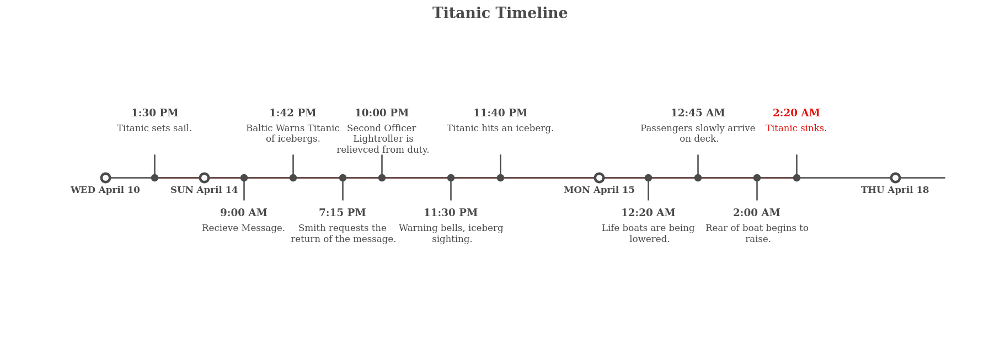
    


```python
fig = plt.figure(figsize=(15, 11), facecolor='white')

gs = fig.add_gridspec(3, 4)

ax_sex_survived = fig.add_subplot(gs[:2,:2])
sns.countplot(x='Sex',hue='Survived', data=train, ax=ax_sex_survived, 
              palette=survived_palette)

ax_survived_sex = fig.add_subplot(gs[:2,2:4], sharey=ax_sex_survived)   # 위와 y축을 공유하겠다
sns.countplot(x='Survived',hue='Sex', data=train, ax=ax_survived_sex,
              palette=sex_palette
             )

# ax_survived_sex.set_yticks([])
ax_survived_sex.set_ylabel('')

ax_pie_male = fig.add_subplot(gs[2, 0])
ax_pie_female = fig.add_subplot(gs[2, 1])
ax_pie_notsurvived = fig.add_subplot(gs[2, 2])
ax_pie_survived = fig.add_subplot(gs[2, 3])

# Sex
male = train[train['Sex']=='male']['Survived'].value_counts().sort_index()
ax_pie_male.pie(male, labels=male.index, autopct='%1.1f%%',explode = (0, 0.1), startangle=90,
               colors=survived_palette
               )

female = train[train['Sex']=='female']['Survived'].value_counts().sort_index()
ax_pie_female.pie(female, labels=female.index, autopct='%1.1f%%',explode = (0, 0.1), startangle=90,
                colors=survived_palette
                 )

# Survived
notsurvived = train[train['Survived']==0]['Sex'].value_counts()[['male', 'female']]
ax_pie_notsurvived.pie(notsurvived, labels=notsurvived.index, autopct='%1.1f%%',startangle=90,
                      colors=sex_palette, textprops={'color':"w"}
                      )

survived = train[train['Survived']==1]['Sex'].value_counts()[['male', 'female']]
ax_pie_survived.pie(survived, labels=survived.index, autopct='%1.1f%%', startangle=90,
                    colors=sex_palette, textprops={'color':"w"}
                   )

fig.suptitle('[Sex & Survived] Conditional Distribution', fontweight='bold', fontsize=20)
fig.text(s='''Gender and survival are the most important features of the existing Titanic problem.\nLook at each conditional probability and think of the minimum score''', 
         x=0.5, y= 0.94, ha='center', va='top')   # horizontal alignment

plt.show()
```


    
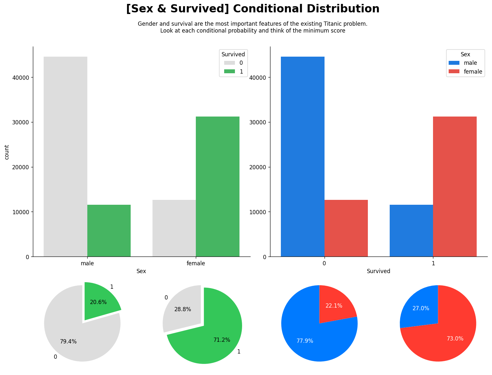
    


```python
survived_palette
```


    ['#dddddd', '#34c759']


```python
train[train['Survived']==0]['Sex'].value_counts()[['male', 'female']]
```


    male      44566
    female    12660
    Name: Sex, dtype: int64


```python
train[train['Sex']=='female']['Survived'].value_counts().sort_index()
```


    0    12660
    1    31226
    Name: Survived, dtype: int64


---


```python
def age_band(num):   # 
    for i in range(1, 100):
        if num < 10*i :  return f'{(i-1) * 10} ~ {i*10}'

train['Age band'] = train['Age'].apply(age_band)
titanic_age = train[['Age band', 'Survived']].groupby('Age band')['Survived'].value_counts().sort_index().unstack().fillna(0)
titanic_age['Survival rate'] = titanic_age[1] / (titanic_age[0] + titanic_age[1]) * 100
age_band = train['Age band'].value_counts().sort_index()
```


```python
age_band
```


    0 ~ 10      8611
    10 ~ 20     4999
    20 ~ 30    20283
    30 ~ 40    15783
    40 ~ 50    15677
    50 ~ 60    18134
    60 ~ 70    10819
    70 ~ 80     2318
    80 ~ 90       84
    Name: Age band, dtype: int64


```python
from mpl_toolkits.axes_grid1.axes_divider import make_axes_locatable

fig = plt.figure(figsize=(15, 10), facecolor='white')
gs = fig.add_gridspec(3, 4)
ax = fig.add_subplot(gs[:-1,:])

color_map = ['#d4dddd' for _ in range(9)]
color_map[2] = light_palette[3]
color_map[8] = light_palette[2]


bars = ax.bar(titanic_age['Survival rate'].index, titanic_age['Survival rate'], 
       color=color_map, width=0.55, 
       edgecolor='black', 
       linewidth=0.7)


ax.spines[["top","right","left"]].set_visible(False)
ax.bar_label(bars, fmt='%.2f%%')


# mean line + annotation
mean = train['Survived'].mean() *100
ax.axhline(mean ,color='black', linewidth=0.4, linestyle='dashdot')
ax.annotate(f"mean : {mean :.4}%", 
            xy=('20 ~ 30', mean + 4),
            va = 'center', ha='center',
            color='#4a4a4a',
            bbox=dict(boxstyle='round', pad=0.4, facecolor='#efe8d1', linewidth=0))   # 주석을 다는 부분


ax.set_yticks(np.arange(0, 81, 20))
ax.grid(axis='y', linestyle='-', alpha=0.4)
ax.set_ylim(0, 100)
    
# -----------------------

ax_bottom = fig.add_subplot(gs[-1,:])
bars = ax_bottom.bar(age_band.index, age_band, width=0.55, 
       edgecolor='black', 
       linewidth=0.7)

ax_bottom.spines[["top","right","left"]].set_visible(False)
ax_bottom.bar_label(bars, fmt='%d', label_type='center', color='white')
ax_bottom.grid(axis='y', linestyle='-', alpha=0.4)

# Title & Subtitle    
fig.text(0.1, 1, 'Age Band & Survival Rate', fontsize=15, fontweight='bold', fontfamily='serif', ha='left')
fig.text(0.1, 0.96, 'Unlike before, the survival rate of infants and toddlers is very low.', fontsize=12, fontweight='light', fontfamily='serif', ha='left')

plt.show()
```


    
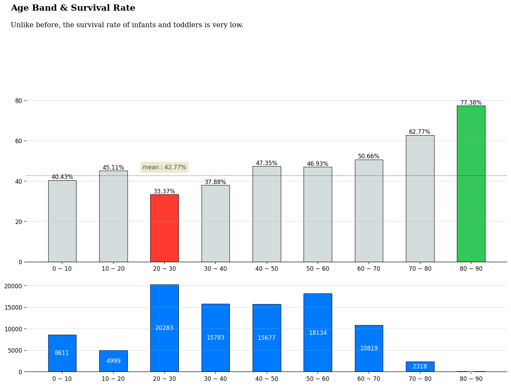
    


### SibSp & Parch


```python
sibsp = train.groupby('SibSp')['Survived'].mean().sort_index()*100
parch = train.groupby('Parch')['Survived'].mean().sort_index()*100

fig, axes = plt.subplots(2, 2, figsize=(17, 12), facecolor='white')

# Ratio 1
axes[0][0].bar(height=100, x=sibsp.index, color='#dedede')
hbar1 = axes[0][0].bar(height=sibsp, x=sibsp.index, color=light_palette[2])
axes[0][0].bar_label(hbar1, fmt='%.01f%%', padding=2)

# Bar1
sibsp_cnt = train['SibSp'].value_counts().sort_index()
bar1 = axes[1][0].bar(height=sibsp_cnt, x=sibsp_cnt.index)
axes[1][0].bar_label(bar1, fmt='%d', padding=2)

# Ratio 2
axes[0][1].bar(height=100, x=parch.index, color='#dedede')
hbar2 = axes[0][1].bar(height=parch, x=parch.index, color=light_palette[2])
axes[0][1].bar_label(hbar2, fmt='%.01f%%', padding=2)

# Bar2
parch_cnt = train['Parch'].value_counts().sort_index()
bar2 = axes[1][1].bar(height=parch_cnt, x=parch_cnt.index)
axes[1][1].bar_label(bar2, fmt='%d', padding=2)

for ax in axes.flatten():
    ax.set_yticks([])
    ax.set_xticks(range(0, max(parch.index)+1))
    ax.spines[['bottom', 'left']].set_visible(False)

axes[0][0].axhline(mean ,color='black', linewidth=0.4, linestyle='dashdot')
axes[0][1].axhline(mean ,color='black', linewidth=0.4, linestyle='dashdot')

for idx, ax in enumerate(axes[0]):
    ax.annotate(f"mean : {mean :.4}%", 
            xy=(6.5+idx, mean + 4),
            va = 'center', ha='center',
            color='#4a4a4a', fontsize=10,
            bbox=dict(boxstyle='round', pad=0.4, facecolor='#efe8d1', linewidth=0))
    

axes[0][0].set_title('Siblings/Spouses Survived Ratio', fontsize=14, fontweight='bold')
axes[0][1].set_title('Parent/Children Survived Ratio', fontsize=14, fontweight='bold')


plt.show()
```


    
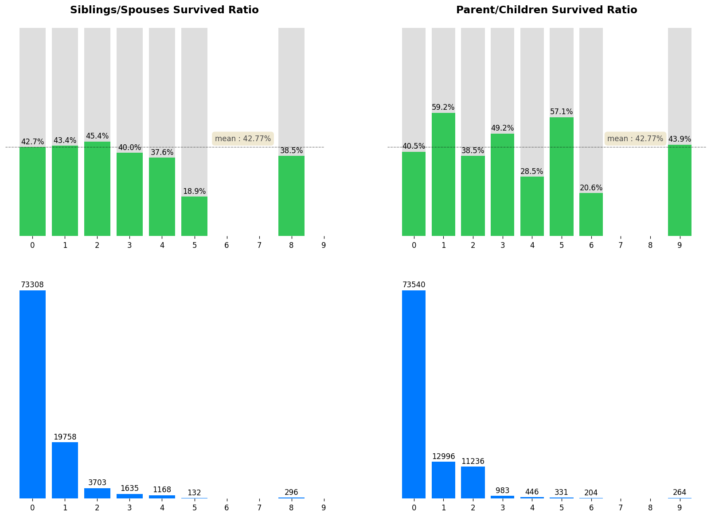
    


```python
max(sibsp.index)
```


    8


```python
train['Family'] = train['SibSp'] + train['Parch']
family_ratio = train.groupby('Family')['Survived'].mean() * 100
```


```python
fig, ax = plt.subplots(1, 1, figsize=(12, 7), facecolor='white')

color_map = ['#d4dddd' for _ in range(len(family_ratio))]
color_map[np.argmax(family_ratio)] = light_palette[2]


bars = ax.bar(family_ratio.index, family_ratio, 
       color=color_map, width=0.55, 
       edgecolor='black', 
       linewidth=0.7)

ax.spines[["top","right","left"]].set_visible(False)
ax.bar_label(bars, fmt='%.2f%%')

# mean line + annotation
ax.axhline(mean ,color='black', linewidth=0.4, linestyle='dashdot')
ax.annotate(f"mean : {mean :.4}%", 
            xy=(15, mean + 2),
            va = 'center', ha='center',
            color='#4a4a4a',
            bbox=dict(boxstyle='round', pad=0.4, facecolor='#efe8d1', linewidth=0))
    

# Title & Subtitle    
fig.text(0.06, 1, '# of Family & Survived', fontsize=15, fontweight='bold', fontfamily='serif')
fig.text(0.06, 0.96, 'The more family members there are, the lower the survival rate tends to be.', fontsize=12, fontweight='light', fontfamily='serif')

ax.set_yticks([])
ax.set_xticks(np.arange(0, max(family_ratio.index)+1))
ax.grid(axis='y', linestyle='-', alpha=0.4)
ax.set_ylim(0, 65)

fig.tight_layout()
plt.show()
```


    
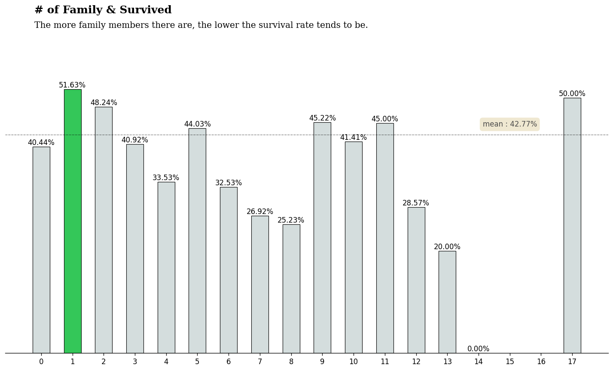
    


```python
fig = plt.figure(figsize=(12, 8), facecolor='white')

gs = fig.add_gridspec(3,1)
gs.update(hspace= -0.55)

axes = list()
colors = light_palette[-3:]

for idx, cls, c in zip(range(3), sorted(train['Pclass'].unique()), colors):
    axes.append(fig.add_subplot(gs[idx, 0]))
    
    # you can also draw density plot with matplotlib + scipy.
    sns.kdeplot(x='Age', data=train[train['Pclass']==cls], 
                fill=True, ax=axes[idx], cut=0, bw_method=0.20, 
                lw=1.4, edgecolor='lightgray', color=c, alpha=1) 
    
    axes[idx].set_ylim(0, 0.035)
    axes[idx].set_xlim(0, 85)
    
    axes[idx].set_yticks([])
    if idx != 2 : axes[idx].set_xticks([])
    axes[idx].set_ylabel('')
    axes[idx].set_xlabel('')


    axes[idx].spines[["top","right","left","bottom"]].set_visible(False)
        
    axes[idx].patch.set_alpha(0)
    axes[idx].text(-0.2,0,f'Pclass {cls}',fontweight="light", fontfamily='serif', fontsize=11,ha="right")

fig.text(0.13,0.81,"Age distribution by Pclass in Titanic", fontweight="bold", fontfamily='serif', fontsize=16)
plt.show()
```


    
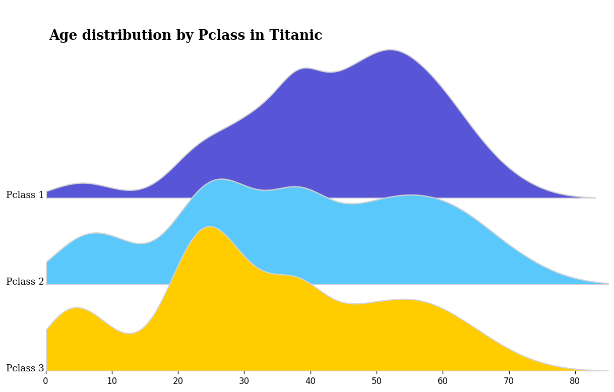
    


```python
fig = plt.figure(figsize=(12, 8), facecolor='white')
gs = fig.add_gridspec(3,1)
gs.update(hspace= -0.55)

axes = list()

for idx, cls, c in zip(range(3), sorted(train['Pclass'].unique()), colors):
    axes.append(fig.add_subplot(gs[idx, 0]))
    
    # you can also draw density plot with matplotlib + scipy.
    sns.kdeplot(x='Age', data=train[train['Pclass']==cls], 
                fill=True, ax=axes[idx], cut=0, bw_method=0.20, 
                lw=1.4, edgecolor='lightgray', hue='Survived', 
                palette=survived_palette, alpha=0.7
               ) 
    
    axes[idx].set_ylim(0, 0.025)
    axes[idx].set_xlim(0, 85)
    
    axes[idx].set_yticks([])
    if idx != 2 : axes[idx].set_xticks([])
    axes[idx].set_ylabel('')
    axes[idx].set_xlabel('')
    axes[idx].spines[["top","right","left","bottom"]].set_visible(False)
        
    axes[idx].patch.set_alpha(0)
    axes[idx].text(-0.5,0,f'Pclass {cls}',fontweight="light", fontfamily='serif', fontsize=11,ha="right")
    if idx != 1 : axes[idx].get_legend().remove()
        
fig.text(0.13,0.81,"Age distribution by Pclass in Titanic", fontweight="bold", fontfamily='serif', fontsize=16)

plt.show()
```


    
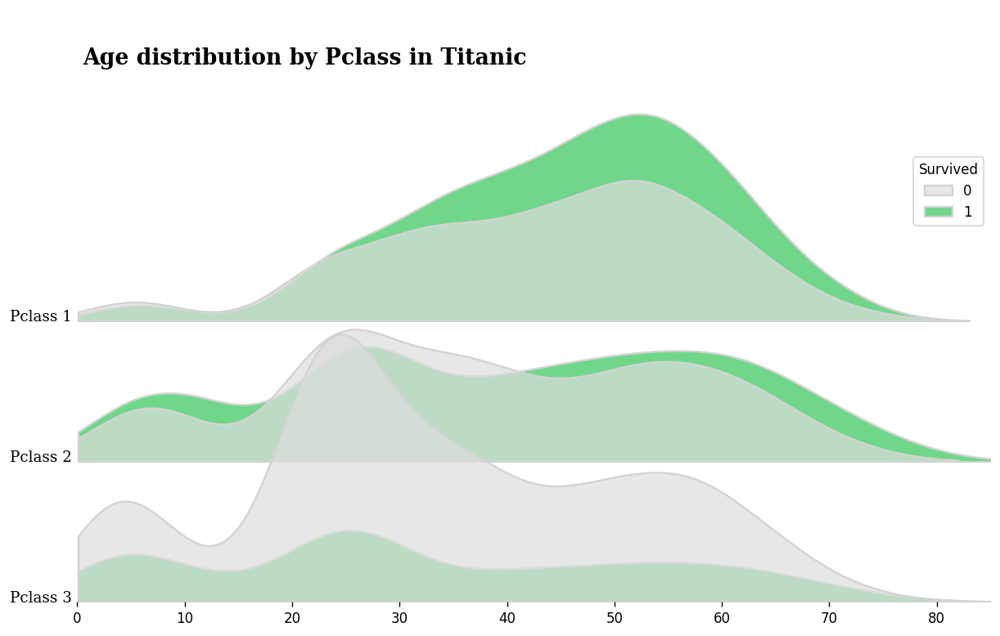
    


```python
fig, axes = plt.subplots(1, 2, figsize=(10, 5), facecolor='white')

for idx, feature in enumerate(['Pclass', 'Embarked']):
    sns.heatmap(train.groupby(['Sex', feature])['Survived'].aggregate('mean').unstack()*100, ax=axes[idx],
                square=True, annot=True, fmt='.2f', center=0, linewidth=2, vmax=80, vmin=-80,
                cbar_kws={"orientation": "horizontal"}, cmap=sns.diverging_palette(240, 10, as_cmap=True)
               ) 

axes[0].set_title('Sex & Pclass Survived Ratio', loc='left', fontweight='bold')    
axes[1].set_title('Sex & Embarked Survived Ratio', loc='left', fontweight='bold')    
plt.show()
```


    

    


```python
train.groupby(['Sex', feature])['Survived'].aggregate('mean').unstack()*100
```


<div>
<style scoped>
    .dataframe tbody tr th:only-of-type {
        vertical-align: middle;
    }

    .dataframe tbody tr th {
        vertical-align: top;
    }

    .dataframe thead th {
        text-align: right;
    }
</style>
<table border="1" class="dataframe">
  <thead>
    <tr style="text-align: right;">
      <th>Embarked</th>
      <th>C</th>
      <th>Q</th>
      <th>S</th>
    </tr>
    <tr>
      <th>Sex</th>
      <th></th>
      <th></th>
      <th></th>
    </tr>
  </thead>
  <tbody>
    <tr>
      <th>female</th>
      <td>84.669961</td>
      <td>69.807892</td>
      <td>62.482896</td>
    </tr>
    <tr>
      <th>male</th>
      <td>51.601312</td>
      <td>34.923664</td>
      <td>15.984341</td>
    </tr>
  </tbody>
</table>
</div>


```python
fig, axes = plt.subplots(2, 1, figsize=(12 , 9), sharex=True, facecolor='white')

for idx, feature in enumerate(['Pclass', 'Embarked']):
    sns.heatmap(train.groupby([feature, 'Age band'])['Survived'].aggregate('mean').unstack()*100, ax=axes[idx],
                square=True, annot=True, fmt='.2f', center=mean, linewidth=2,
                cbar=False, cmap=sns.diverging_palette(240, 10, as_cmap=True)
               ) 

    
axes[0].set_title('Pclass & Age Band Survived Ratio', loc='left', fontweight='bold')
axes[1].set_title('Embarked & Age Band Survived Ratio', loc='left', fontweight='bold')   

plt.show()
```


    
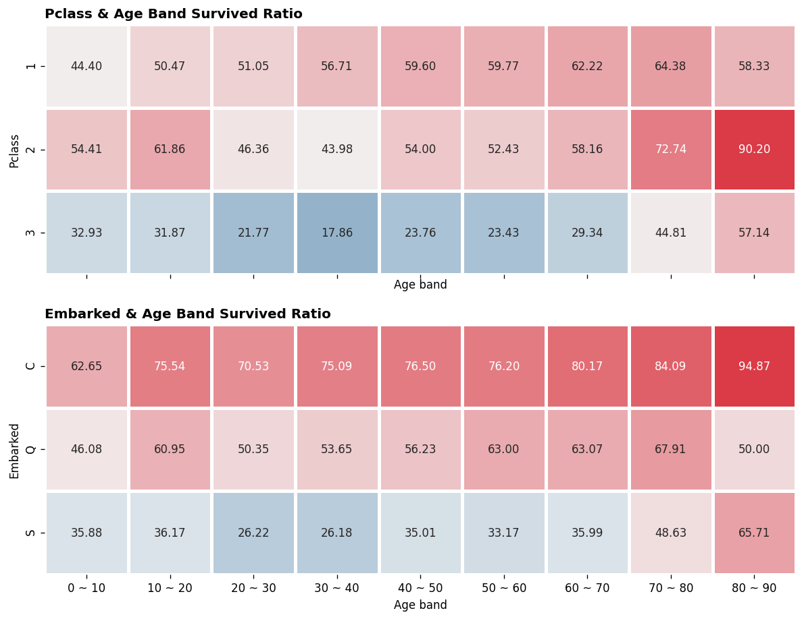
    


```python
fig, ax = plt.subplots(1, 3, figsize=(17 , 5), facecolor='white')

feature_lst = ['Pclass', 'Age', 'SibSp','Parch','Fare', 'Family']

corr = train[feature_lst].corr()

mask = np.zeros_like(corr, dtype=np.bool)
mask[np.triu_indices_from(mask)] = True


for idx, method in enumerate(['pearson', 'kendall', 'spearman']):
    sns.heatmap(train[feature_lst].corr(method=method), ax=ax[idx],
            square=True, annot=True, fmt='.2f', center=0, linewidth=2,
            cbar=False, cmap=sns.diverging_palette(240, 10, as_cmap=True),
            mask=mask
           ) 
    ax[idx].set_title(f'{method.capitalize()} Correlation', loc='left', fontweight='bold')     

plt.tight_layout()
plt.show()
```


    
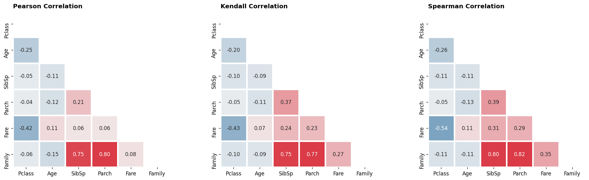
    


```python
def converter(x):
    c, n = '', ''
    x = str(x).replace('.', '').replace('/','').replace(' ', '')
    for i in x:
        if i.isnumeric():
            n += i
        else :
            c += i 
    if n != '':
        return c, int(n)
    return c, np.nan

train['Ticket_type'] = train['Ticket'].apply(lambda x: converter(x)[0])
train['Ticket_number'] = train['Ticket'].apply(lambda x: converter(x)[1])
```


```python
train['Ticket'].value_counts()
```


    A/5                602
    C.A.               177
    SC/PARIS           145
    SOTON/O.Q.          80
    SC                  57
                      ... 
    CA. 448752           1
    SC/AH 436390         1
    SOTON/OQ 418673      1
    213157               1
    23983                1
    Name: Ticket, Length: 75331, dtype: int64


```python
converter('SOTON/OQ 418673')
```


    ('SOTONOQ', 418673)


```python
# viz from myself : https://www.kaggle.com/subinium/showusthedata-eda-visualization-utils
fig = plt.figure(figsize=(15, 7), facecolor='white')

gs = fig.add_gridspec(5, 6)

ax1 = fig.add_subplot(gs[0,:])
dataset_label = train['Ticket_type'].value_counts()[1:]
ax1.bar(dataset_label.index, dataset_label,
       color=[light_palette[0]]*10 + ['#d4dddd']*(len(dataset_label) - 21)
       )
ax1.set_xticks([])


ax2 = fig.add_subplot(gs[1:,:])
dataset_label = train['Ticket_type'].value_counts()[1:11]
ax2.bar(dataset_label.index, dataset_label)
ax2.set_xticks(range(len(dataset_label.index)))
ax2.set_xticklabels(dataset_label.index, rotation = 90)


fig.text(0.125,0.9,'Ticket Type Distribution', fontsize=20, fontweight='bold', fontfamily='serif')
plt.show()
```


    
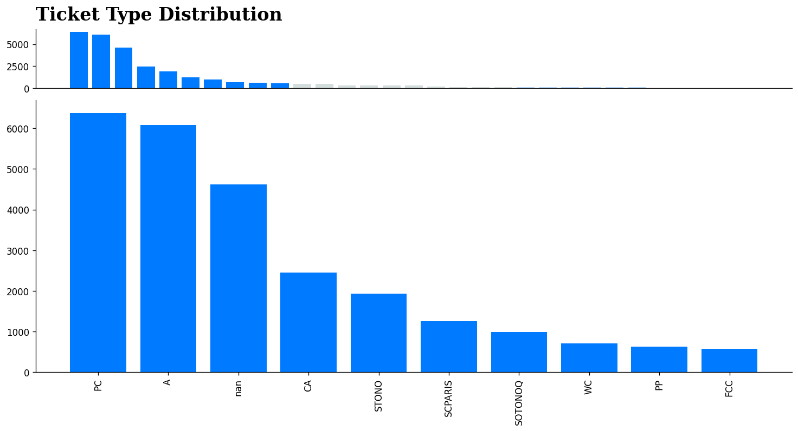
    


```python
train['Ticket_type'].value_counts()
```


               70722
    PC          6375
    A           6087
    nan         4623
    CA          2448
    STONO       1928
    SCPARIS     1248
    SOTONOQ      992
    WC           711
    PP           622
    FCC          577
    SCParis      530
    SCAH         525
    WEP          344
    SOC          339
    FC           296
    SOTONO       290
    C            220
    SC           164
    PPP          149
    SOPP         134
    SCA          104
    AQ           103
    SCOW         101
    SWPP          69
    LP            56
    Fa            54
    AS            44
    STONOQ        38
    CASOTON       37
    SOP           36
    SP            34
    Name: Ticket_type, dtype: int64


```python
nan_data = (train.isna().sum().sort_values(ascending=False) / len(train) * 100)[:6]
fig, ax = plt.subplots(1,1,figsize=(7, 5), facecolor='white')

ax.bar(nan_data.index, 100, color='#dadada', width=0.6)

bar = ax.bar(nan_data.index,nan_data, color=light_palette[1], width=0.6)
ax.bar_label(bar, fmt='%.01f %%')
ax.spines.left.set_visible(False)
ax.set_yticks([])
ax.set_title('Null Data Ratio', fontweight='bold')

plt.show()
```


    
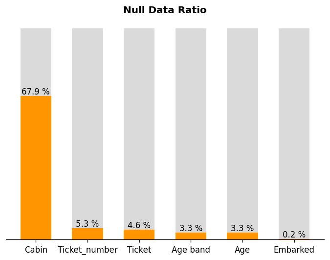
    


```python
pd.pivot_table(train, values='Fare', index=['Family'], columns=['Survived'], aggfunc=[np.mean, np.std])\
.style.bar(subset=['mean'], color='#205ff2').background_gradient(subset=['std'], cmap='Reds')
```


<style  type="text/css" >
#T_f09ac23d_f519_11eb_8a68_f02f74af3f8brow0_col0{
            width:  10em;
             height:  80%;
            background:  linear-gradient(90deg,#205ff2 13.1%, transparent 13.1%);
        }#T_f09ac23d_f519_11eb_8a68_f02f74af3f8brow0_col1{
            width:  10em;
             height:  80%;
            background:  linear-gradient(90deg,#205ff2 53.1%, transparent 53.1%);
        }#T_f09ac23d_f519_11eb_8a68_f02f74af3f8brow0_col2{
            background-color:  #fcae92;
            color:  #000000;
        }#T_f09ac23d_f519_11eb_8a68_f02f74af3f8brow0_col3{
            background-color:  #f0402f;
            color:  #f1f1f1;
        }#T_f09ac23d_f519_11eb_8a68_f02f74af3f8brow1_col0{
            width:  10em;
             height:  80%;
            background:  linear-gradient(90deg,#205ff2 41.9%, transparent 41.9%);
        }#T_f09ac23d_f519_11eb_8a68_f02f74af3f8brow1_col1{
            width:  10em;
             height:  80%;
            background:  linear-gradient(90deg,#205ff2 71.7%, transparent 71.7%);
        }#T_f09ac23d_f519_11eb_8a68_f02f74af3f8brow1_col2{
            background-color:  #fb6d4d;
            color:  #000000;
        }#T_f09ac23d_f519_11eb_8a68_f02f74af3f8brow1_col3{
            background-color:  #e63328;
            color:  #f1f1f1;
        }#T_f09ac23d_f519_11eb_8a68_f02f74af3f8brow2_col0{
            width:  10em;
             height:  80%;
            background:  linear-gradient(90deg,#205ff2 36.3%, transparent 36.3%);
        }#T_f09ac23d_f519_11eb_8a68_f02f74af3f8brow2_col1{
            width:  10em;
             height:  80%;
            background:  linear-gradient(90deg,#205ff2 54.4%, transparent 54.4%);
        }#T_f09ac23d_f519_11eb_8a68_f02f74af3f8brow2_col2,#T_f09ac23d_f519_11eb_8a68_f02f74af3f8brow4_col2{
            background-color:  #fc8b6b;
            color:  #000000;
        }#T_f09ac23d_f519_11eb_8a68_f02f74af3f8brow2_col3{
            background-color:  #fb6b4b;
            color:  #000000;
        }#T_f09ac23d_f519_11eb_8a68_f02f74af3f8brow3_col0{
            width:  10em;
             height:  80%;
            background:  linear-gradient(90deg,#205ff2 46.8%, transparent 46.8%);
        }#T_f09ac23d_f519_11eb_8a68_f02f74af3f8brow3_col1{
            width:  10em;
             height:  80%;
            background:  linear-gradient(90deg,#205ff2 58.8%, transparent 58.8%);
        }#T_f09ac23d_f519_11eb_8a68_f02f74af3f8brow3_col2{
            background-color:  #fc9576;
            color:  #000000;
        }#T_f09ac23d_f519_11eb_8a68_f02f74af3f8brow3_col3{
            background-color:  #fb7858;
            color:  #000000;
        }#T_f09ac23d_f519_11eb_8a68_f02f74af3f8brow4_col0{
            width:  10em;
             height:  80%;
            background:  linear-gradient(90deg,#205ff2 32.0%, transparent 32.0%);
        }#T_f09ac23d_f519_11eb_8a68_f02f74af3f8brow4_col1{
            width:  10em;
             height:  80%;
            background:  linear-gradient(90deg,#205ff2 57.3%, transparent 57.3%);
        }#T_f09ac23d_f519_11eb_8a68_f02f74af3f8brow4_col3{
            background-color:  #f85d42;
            color:  #000000;
        }#T_f09ac23d_f519_11eb_8a68_f02f74af3f8brow5_col0{
            width:  10em;
             height:  80%;
            background:  linear-gradient(90deg,#205ff2 38.7%, transparent 38.7%);
        }#T_f09ac23d_f519_11eb_8a68_f02f74af3f8brow5_col1{
            width:  10em;
             height:  80%;
            background:  linear-gradient(90deg,#205ff2 39.5%, transparent 39.5%);
        }#T_f09ac23d_f519_11eb_8a68_f02f74af3f8brow5_col2,#T_f09ac23d_f519_11eb_8a68_f02f74af3f8brow5_col3{
            background-color:  #fc8a6a;
            color:  #000000;
        }#T_f09ac23d_f519_11eb_8a68_f02f74af3f8brow6_col0{
            width:  10em;
             height:  80%;
            background:  linear-gradient(90deg,#205ff2 26.6%, transparent 26.6%);
        }#T_f09ac23d_f519_11eb_8a68_f02f74af3f8brow6_col1{
            width:  10em;
             height:  80%;
            background:  linear-gradient(90deg,#205ff2 29.2%, transparent 29.2%);
        }#T_f09ac23d_f519_11eb_8a68_f02f74af3f8brow6_col2{
            background-color:  #fca082;
            color:  #000000;
        }#T_f09ac23d_f519_11eb_8a68_f02f74af3f8brow6_col3{
            background-color:  #fc9777;
            color:  #000000;
        }#T_f09ac23d_f519_11eb_8a68_f02f74af3f8brow7_col0{
            width:  10em;
             height:  80%;
            background:  linear-gradient(90deg,#205ff2 40.2%, transparent 40.2%);
        }#T_f09ac23d_f519_11eb_8a68_f02f74af3f8brow7_col1,#T_f09ac23d_f519_11eb_8a68_f02f74af3f8brow12_col0{
            width:  10em;
             height:  80%;
            background:  linear-gradient(90deg,#205ff2 100.0%, transparent 100.0%);
        }#T_f09ac23d_f519_11eb_8a68_f02f74af3f8brow7_col2{
            background-color:  #fc8262;
            color:  #000000;
        }#T_f09ac23d_f519_11eb_8a68_f02f74af3f8brow7_col3,#T_f09ac23d_f519_11eb_8a68_f02f74af3f8brow12_col2{
            background-color:  #67000d;
            color:  #f1f1f1;
        }#T_f09ac23d_f519_11eb_8a68_f02f74af3f8brow8_col0{
            width:  10em;
             height:  80%;
            background:  linear-gradient(90deg,#205ff2 31.4%, transparent 31.4%);
        }#T_f09ac23d_f519_11eb_8a68_f02f74af3f8brow8_col1{
            width:  10em;
             height:  80%;
            background:  linear-gradient(90deg,#205ff2 32.7%, transparent 32.7%);
        }#T_f09ac23d_f519_11eb_8a68_f02f74af3f8brow8_col2{
            background-color:  #fb7b5b;
            color:  #000000;
        }#T_f09ac23d_f519_11eb_8a68_f02f74af3f8brow8_col3{
            background-color:  #e02c26;
            color:  #f1f1f1;
        }#T_f09ac23d_f519_11eb_8a68_f02f74af3f8brow9_col0{
            width:  10em;
             height:  80%;
            background:  linear-gradient(90deg,#205ff2 25.8%, transparent 25.8%);
        }#T_f09ac23d_f519_11eb_8a68_f02f74af3f8brow9_col1{
            width:  10em;
             height:  80%;
            background:  linear-gradient(90deg,#205ff2 34.7%, transparent 34.7%);
        }#T_f09ac23d_f519_11eb_8a68_f02f74af3f8brow9_col2{
            background-color:  #fcb095;
            color:  #000000;
        }#T_f09ac23d_f519_11eb_8a68_f02f74af3f8brow9_col3{
            background-color:  #fc8d6d;
            color:  #000000;
        }#T_f09ac23d_f519_11eb_8a68_f02f74af3f8brow10_col0{
            width:  10em;
             height:  80%;
            background:  linear-gradient(90deg,#205ff2 57.5%, transparent 57.5%);
        }#T_f09ac23d_f519_11eb_8a68_f02f74af3f8brow10_col1{
            width:  10em;
             height:  80%;
            background:  linear-gradient(90deg,#205ff2 81.9%, transparent 81.9%);
        }#T_f09ac23d_f519_11eb_8a68_f02f74af3f8brow10_col2,#T_f09ac23d_f519_11eb_8a68_f02f74af3f8brow10_col3{
            background-color:  #f6583e;
            color:  #000000;
        }#T_f09ac23d_f519_11eb_8a68_f02f74af3f8brow11_col0{
            width:  10em;
             height:  80%;
            background:  linear-gradient(90deg,#205ff2 19.4%, transparent 19.4%);
        }#T_f09ac23d_f519_11eb_8a68_f02f74af3f8brow11_col1{
            width:  10em;
             height:  80%;
            background:  linear-gradient(90deg,#205ff2 18.6%, transparent 18.6%);
        }#T_f09ac23d_f519_11eb_8a68_f02f74af3f8brow11_col2{
            background-color:  #fee7dc;
            color:  #000000;
        }#T_f09ac23d_f519_11eb_8a68_f02f74af3f8brow11_col3,#T_f09ac23d_f519_11eb_8a68_f02f74af3f8brow13_col2,#T_f09ac23d_f519_11eb_8a68_f02f74af3f8brow14_col2{
            background-color:  #fff5f0;
            color:  #000000;
        }#T_f09ac23d_f519_11eb_8a68_f02f74af3f8brow12_col1{
            width:  10em;
             height:  80%;
            background:  linear-gradient(90deg,#205ff2 47.5%, transparent 47.5%);
        }#T_f09ac23d_f519_11eb_8a68_f02f74af3f8brow12_col3{
            background-color:  #fedccd;
            color:  #000000;
        }#T_f09ac23d_f519_11eb_8a68_f02f74af3f8brow13_col0{
            width:  10em;
             height:  80%;
            background:  linear-gradient(90deg,#205ff2 7.3%, transparent 7.3%);
        }#T_f09ac23d_f519_11eb_8a68_f02f74af3f8brow13_col1{
            width:  10em;
             height:  80%;
            background:  linear-gradient(90deg,#205ff2 5.7%, transparent 5.7%);
        }#T_f09ac23d_f519_11eb_8a68_f02f74af3f8brow13_col3,#T_f09ac23d_f519_11eb_8a68_f02f74af3f8brow14_col3,#T_f09ac23d_f519_11eb_8a68_f02f74af3f8brow15_col2,#T_f09ac23d_f519_11eb_8a68_f02f74af3f8brow15_col3{
            background-color:  #000000;
            color:  #f1f1f1;
        }#T_f09ac23d_f519_11eb_8a68_f02f74af3f8brow14_col0{
            width:  10em;
             height:  80%;
            background:  linear-gradient(90deg,#205ff2 3.9%, transparent 3.9%);
        }#T_f09ac23d_f519_11eb_8a68_f02f74af3f8brow15_col0,#T_f09ac23d_f519_11eb_8a68_f02f74af3f8brow15_col1{
            width:  10em;
             height:  80%;
        }</style><table id="T_f09ac23d_f519_11eb_8a68_f02f74af3f8b" ><thead>    <tr>        <th class="blank level0" ></th>        <th class="col_heading level0 col0" colspan=2>mean</th>        <th class="col_heading level0 col2" colspan=2>std</th>    </tr>    <tr>        <th class="index_name level1" >Survived</th>        <th class="col_heading level1 col0" >0</th>        <th class="col_heading level1 col1" >1</th>        <th class="col_heading level1 col2" >0</th>        <th class="col_heading level1 col3" >1</th>    </tr>    <tr>        <th class="index_name level0" >Family</th>        <th class="blank" ></th>        <th class="blank" ></th>        <th class="blank" ></th>        <th class="blank" ></th>    </tr></thead><tbody>
                <tr>
                        <th id="T_f09ac23d_f519_11eb_8a68_f02f74af3f8blevel0_row0" class="row_heading level0 row0" >0</th>
                        <td id="T_f09ac23d_f519_11eb_8a68_f02f74af3f8brow0_col0" class="data row0 col0" >23.848023</td>
                        <td id="T_f09ac23d_f519_11eb_8a68_f02f74af3f8brow0_col1" class="data row0 col1" >56.905046</td>
                        <td id="T_f09ac23d_f519_11eb_8a68_f02f74af3f8brow0_col2" class="data row0 col2" >46.524100</td>
                        <td id="T_f09ac23d_f519_11eb_8a68_f02f74af3f8brow0_col3" class="data row0 col3" >85.723462</td>
            </tr>
            <tr>
                        <th id="T_f09ac23d_f519_11eb_8a68_f02f74af3f8blevel0_row1" class="row_heading level0 row1" >1</th>
                        <td id="T_f09ac23d_f519_11eb_8a68_f02f74af3f8brow1_col0" class="data row1 col0" >49.806797</td>
                        <td id="T_f09ac23d_f519_11eb_8a68_f02f74af3f8brow1_col1" class="data row1 col1" >67.833425</td>
                        <td id="T_f09ac23d_f519_11eb_8a68_f02f74af3f8brow1_col2" class="data row1 col2" >71.945489</td>
                        <td id="T_f09ac23d_f519_11eb_8a68_f02f74af3f8brow1_col3" class="data row1 col3" >90.327915</td>
            </tr>
            <tr>
                        <th id="T_f09ac23d_f519_11eb_8a68_f02f74af3f8blevel0_row2" class="row_heading level0 row2" >2</th>
                        <td id="T_f09ac23d_f519_11eb_8a68_f02f74af3f8brow2_col0" class="data row2 col0" >44.777701</td>
                        <td id="T_f09ac23d_f519_11eb_8a68_f02f74af3f8brow2_col1" class="data row2 col1" >57.692290</td>
                        <td id="T_f09ac23d_f519_11eb_8a68_f02f74af3f8brow2_col2" class="data row2 col2" >59.989918</td>
                        <td id="T_f09ac23d_f519_11eb_8a68_f02f74af3f8brow2_col3" class="data row2 col3" >73.350892</td>
            </tr>
            <tr>
                        <th id="T_f09ac23d_f519_11eb_8a68_f02f74af3f8blevel0_row3" class="row_heading level0 row3" >3</th>
                        <td id="T_f09ac23d_f519_11eb_8a68_f02f74af3f8brow3_col0" class="data row3 col0" >54.195039</td>
                        <td id="T_f09ac23d_f519_11eb_8a68_f02f74af3f8brow3_col1" class="data row3 col1" >60.251581</td>
                        <td id="T_f09ac23d_f519_11eb_8a68_f02f74af3f8brow3_col2" class="data row3 col2" >56.054986</td>
                        <td id="T_f09ac23d_f519_11eb_8a68_f02f74af3f8brow3_col3" class="data row3 col3" >68.600871</td>
            </tr>
            <tr>
                        <th id="T_f09ac23d_f519_11eb_8a68_f02f74af3f8blevel0_row4" class="row_heading level0 row4" >4</th>
                        <td id="T_f09ac23d_f519_11eb_8a68_f02f74af3f8brow4_col0" class="data row4 col0" >40.915451</td>
                        <td id="T_f09ac23d_f519_11eb_8a68_f02f74af3f8brow4_col1" class="data row4 col1" >59.362057</td>
                        <td id="T_f09ac23d_f519_11eb_8a68_f02f74af3f8brow4_col2" class="data row4 col2" >59.897070</td>
                        <td id="T_f09ac23d_f519_11eb_8a68_f02f74af3f8brow4_col3" class="data row4 col3" >77.096359</td>
            </tr>
            <tr>
                        <th id="T_f09ac23d_f519_11eb_8a68_f02f74af3f8blevel0_row5" class="row_heading level0 row5" >5</th>
                        <td id="T_f09ac23d_f519_11eb_8a68_f02f74af3f8brow5_col0" class="data row5 col0" >46.907097</td>
                        <td id="T_f09ac23d_f519_11eb_8a68_f02f74af3f8brow5_col1" class="data row5 col1" >48.942161</td>
                        <td id="T_f09ac23d_f519_11eb_8a68_f02f74af3f8brow5_col2" class="data row5 col2" >60.557552</td>
                        <td id="T_f09ac23d_f519_11eb_8a68_f02f74af3f8brow5_col3" class="data row5 col3" >62.512531</td>
            </tr>
            <tr>
                        <th id="T_f09ac23d_f519_11eb_8a68_f02f74af3f8blevel0_row6" class="row_heading level0 row6" >6</th>
                        <td id="T_f09ac23d_f519_11eb_8a68_f02f74af3f8brow6_col0" class="data row6 col0" >36.023185</td>
                        <td id="T_f09ac23d_f519_11eb_8a68_f02f74af3f8brow6_col1" class="data row6 col1" >42.925185</td>
                        <td id="T_f09ac23d_f519_11eb_8a68_f02f74af3f8brow6_col2" class="data row6 col2" >51.888770</td>
                        <td id="T_f09ac23d_f519_11eb_8a68_f02f74af3f8brow6_col3" class="data row6 col3" >58.342596</td>
            </tr>
            <tr>
                        <th id="T_f09ac23d_f519_11eb_8a68_f02f74af3f8blevel0_row7" class="row_heading level0 row7" >7</th>
                        <td id="T_f09ac23d_f519_11eb_8a68_f02f74af3f8brow7_col0" class="data row7 col0" >48.243421</td>
                        <td id="T_f09ac23d_f519_11eb_8a68_f02f74af3f8brow7_col1" class="data row7 col1" >84.428214</td>
                        <td id="T_f09ac23d_f519_11eb_8a68_f02f74af3f8brow7_col2" class="data row7 col2" >63.403472</td>
                        <td id="T_f09ac23d_f519_11eb_8a68_f02f74af3f8brow7_col3" class="data row7 col3" >128.229382</td>
            </tr>
            <tr>
                        <th id="T_f09ac23d_f519_11eb_8a68_f02f74af3f8blevel0_row8" class="row_heading level0 row8" >8</th>
                        <td id="T_f09ac23d_f519_11eb_8a68_f02f74af3f8brow8_col0" class="data row8 col0" >40.329277</td>
                        <td id="T_f09ac23d_f519_11eb_8a68_f02f74af3f8brow8_col1" class="data row8 col1" >44.976786</td>
                        <td id="T_f09ac23d_f519_11eb_8a68_f02f74af3f8brow8_col2" class="data row8 col2" >66.559766</td>
                        <td id="T_f09ac23d_f519_11eb_8a68_f02f74af3f8brow8_col3" class="data row8 col3" >93.068843</td>
            </tr>
            <tr>
                        <th id="T_f09ac23d_f519_11eb_8a68_f02f74af3f8blevel0_row9" class="row_heading level0 row9" >9</th>
                        <td id="T_f09ac23d_f519_11eb_8a68_f02f74af3f8brow9_col0" class="data row9 col0" >35.265174</td>
                        <td id="T_f09ac23d_f519_11eb_8a68_f02f74af3f8brow9_col1" class="data row9 col1" >46.119718</td>
                        <td id="T_f09ac23d_f519_11eb_8a68_f02f74af3f8brow9_col2" class="data row9 col2" >45.790690</td>
                        <td id="T_f09ac23d_f519_11eb_8a68_f02f74af3f8brow9_col3" class="data row9 col3" >61.497212</td>
            </tr>
            <tr>
                        <th id="T_f09ac23d_f519_11eb_8a68_f02f74af3f8blevel0_row10" class="row_heading level0 row10" >10</th>
                        <td id="T_f09ac23d_f519_11eb_8a68_f02f74af3f8brow10_col0" class="data row10 col0" >63.900133</td>
                        <td id="T_f09ac23d_f519_11eb_8a68_f02f74af3f8brow10_col1" class="data row10 col1" >73.796604</td>
                        <td id="T_f09ac23d_f519_11eb_8a68_f02f74af3f8brow10_col2" class="data row10 col2" >79.251412</td>
                        <td id="T_f09ac23d_f519_11eb_8a68_f02f74af3f8brow10_col3" class="data row10 col3" >78.626980</td>
            </tr>
            <tr>
                        <th id="T_f09ac23d_f519_11eb_8a68_f02f74af3f8blevel0_row11" class="row_heading level0 row11" >11</th>
                        <td id="T_f09ac23d_f519_11eb_8a68_f02f74af3f8brow11_col0" class="data row11 col0" >29.508182</td>
                        <td id="T_f09ac23d_f519_11eb_8a68_f02f74af3f8brow11_col1" class="data row11 col1" >36.682222</td>
                        <td id="T_f09ac23d_f519_11eb_8a68_f02f74af3f8brow11_col2" class="data row11 col2" >20.255482</td>
                        <td id="T_f09ac23d_f519_11eb_8a68_f02f74af3f8brow11_col3" class="data row11 col3" >18.718711</td>
            </tr>
            <tr>
                        <th id="T_f09ac23d_f519_11eb_8a68_f02f74af3f8blevel0_row12" class="row_heading level0 row12" >12</th>
                        <td id="T_f09ac23d_f519_11eb_8a68_f02f74af3f8brow12_col0" class="data row12 col0" >102.184000</td>
                        <td id="T_f09ac23d_f519_11eb_8a68_f02f74af3f8brow12_col1" class="data row12 col1" >53.640000</td>
                        <td id="T_f09ac23d_f519_11eb_8a68_f02f74af3f8brow12_col2" class="data row12 col2" >137.045144</td>
                        <td id="T_f09ac23d_f519_11eb_8a68_f02f74af3f8brow12_col3" class="data row12 col3" >33.884557</td>
            </tr>
            <tr>
                        <th id="T_f09ac23d_f519_11eb_8a68_f02f74af3f8blevel0_row13" class="row_heading level0 row13" >13</th>
                        <td id="T_f09ac23d_f519_11eb_8a68_f02f74af3f8brow13_col0" class="data row13 col0" >18.652500</td>
                        <td id="T_f09ac23d_f519_11eb_8a68_f02f74af3f8brow13_col1" class="data row13 col1" >29.150000</td>
                        <td id="T_f09ac23d_f519_11eb_8a68_f02f74af3f8brow13_col2" class="data row13 col2" >9.458292</td>
                        <td id="T_f09ac23d_f519_11eb_8a68_f02f74af3f8brow13_col3" class="data row13 col3" >nan</td>
            </tr>
            <tr>
                        <th id="T_f09ac23d_f519_11eb_8a68_f02f74af3f8blevel0_row14" class="row_heading level0 row14" >14</th>
                        <td id="T_f09ac23d_f519_11eb_8a68_f02f74af3f8brow14_col0" class="data row14 col0" >15.506667</td>
                        <td id="T_f09ac23d_f519_11eb_8a68_f02f74af3f8brow14_col1" class="data row14 col1" >nan</td>
                        <td id="T_f09ac23d_f519_11eb_8a68_f02f74af3f8brow14_col2" class="data row14 col2" >9.704753</td>
                        <td id="T_f09ac23d_f519_11eb_8a68_f02f74af3f8brow14_col3" class="data row14 col3" >nan</td>
            </tr>
            <tr>
                        <th id="T_f09ac23d_f519_11eb_8a68_f02f74af3f8blevel0_row15" class="row_heading level0 row15" >17</th>
                        <td id="T_f09ac23d_f519_11eb_8a68_f02f74af3f8brow15_col0" class="data row15 col0" >12.030000</td>
                        <td id="T_f09ac23d_f519_11eb_8a68_f02f74af3f8brow15_col1" class="data row15 col1" >25.780000</td>
                        <td id="T_f09ac23d_f519_11eb_8a68_f02f74af3f8brow15_col2" class="data row15 col2" >nan</td>
                        <td id="T_f09ac23d_f519_11eb_8a68_f02f74af3f8brow15_col3" class="data row15 col3" >nan</td>
            </tr>
    </tbody></table>


```python
train.head()
```


<div>
<style scoped>
    .dataframe tbody tr th:only-of-type {
        vertical-align: middle;
    }

    .dataframe tbody tr th {
        vertical-align: top;
    }

    .dataframe thead th {
        text-align: right;
    }
</style>
<table border="1" class="dataframe">
  <thead>
    <tr style="text-align: right;">
      <th></th>
      <th>PassengerId</th>
      <th>Survived</th>
      <th>Pclass</th>
      <th>Name</th>
      <th>Sex</th>
      <th>Age</th>
      <th>SibSp</th>
      <th>Parch</th>
      <th>Ticket</th>
      <th>Fare</th>
      <th>Cabin</th>
      <th>Embarked</th>
      <th>Age band</th>
      <th>Family</th>
      <th>Ticket_type</th>
      <th>Ticket_number</th>
    </tr>
  </thead>
  <tbody>
    <tr>
      <th>0</th>
      <td>0</td>
      <td>1</td>
      <td>1</td>
      <td>Oconnor, Frankie</td>
      <td>male</td>
      <td>38.355472</td>
      <td>2</td>
      <td>0</td>
      <td>209245</td>
      <td>27.14</td>
      <td>C12239</td>
      <td>S</td>
      <td>None</td>
      <td>2</td>
      <td></td>
      <td>209245.0</td>
    </tr>
    <tr>
      <th>1</th>
      <td>1</td>
      <td>0</td>
      <td>3</td>
      <td>Bryan, Drew</td>
      <td>male</td>
      <td>38.355472</td>
      <td>0</td>
      <td>0</td>
      <td>27323</td>
      <td>13.35</td>
      <td>NaN</td>
      <td>S</td>
      <td>None</td>
      <td>0</td>
      <td></td>
      <td>27323.0</td>
    </tr>
    <tr>
      <th>2</th>
      <td>2</td>
      <td>0</td>
      <td>3</td>
      <td>Owens, Kenneth</td>
      <td>male</td>
      <td>0.330000</td>
      <td>1</td>
      <td>2</td>
      <td>CA 457703</td>
      <td>71.29</td>
      <td>NaN</td>
      <td>S</td>
      <td>0 ~ 10</td>
      <td>3</td>
      <td>CA</td>
      <td>457703.0</td>
    </tr>
    <tr>
      <th>3</th>
      <td>3</td>
      <td>0</td>
      <td>3</td>
      <td>Kramer, James</td>
      <td>male</td>
      <td>19.000000</td>
      <td>0</td>
      <td>0</td>
      <td>A. 10866</td>
      <td>13.04</td>
      <td>NaN</td>
      <td>S</td>
      <td>10 ~ 20</td>
      <td>0</td>
      <td>A</td>
      <td>10866.0</td>
    </tr>
    <tr>
      <th>4</th>
      <td>4</td>
      <td>1</td>
      <td>3</td>
      <td>Bond, Michael</td>
      <td>male</td>
      <td>25.000000</td>
      <td>0</td>
      <td>0</td>
      <td>427635</td>
      <td>7.76</td>
      <td>NaN</td>
      <td>S</td>
      <td>20 ~ 30</td>
      <td>0</td>
      <td></td>
      <td>427635.0</td>
    </tr>
  </tbody>
</table>
</div>


```python
pd.pivot_table(train, values='Fare', index=['Family'],
               columns=['Pclass'], aggfunc=[np.mean, np.std]).style.bar(subset=['mean'], 
            color='#205ff2').background_gradient(subset=['std'], cmap='Reds')
```


<style  type="text/css" >
#T_4ba4d940_f50b_11eb_8c47_f02f74af3f8brow0_col0{
            width:  10em;
             height:  80%;
            background:  linear-gradient(90deg,#205ff2 33.2%, transparent 33.2%);
        }#T_4ba4d940_f50b_11eb_8c47_f02f74af3f8brow0_col1,#T_4ba4d940_f50b_11eb_8c47_f02f74af3f8brow11_col0,#T_4ba4d940_f50b_11eb_8c47_f02f74af3f8brow14_col2{
            width:  10em;
             height:  80%;
        }#T_4ba4d940_f50b_11eb_8c47_f02f74af3f8brow0_col2{
            width:  10em;
             height:  80%;
            background:  linear-gradient(90deg,#205ff2 13.7%, transparent 13.7%);
        }#T_4ba4d940_f50b_11eb_8c47_f02f74af3f8brow0_col3{
            background-color:  #fc7f5f;
            color:  #000000;
        }#T_4ba4d940_f50b_11eb_8c47_f02f74af3f8brow0_col4{
            background-color:  #fb7757;
            color:  #000000;
        }#T_4ba4d940_f50b_11eb_8c47_f02f74af3f8brow0_col5{
            background-color:  #fca285;
            color:  #000000;
        }#T_4ba4d940_f50b_11eb_8c47_f02f74af3f8brow1_col0{
            width:  10em;
             height:  80%;
            background:  linear-gradient(90deg,#205ff2 35.9%, transparent 35.9%);
        }#T_4ba4d940_f50b_11eb_8c47_f02f74af3f8brow1_col1{
            width:  10em;
             height:  80%;
            background:  linear-gradient(90deg,#205ff2 25.7%, transparent 25.7%);
        }#T_4ba4d940_f50b_11eb_8c47_f02f74af3f8brow1_col2{
            width:  10em;
             height:  80%;
            background:  linear-gradient(90deg,#205ff2 48.0%, transparent 48.0%);
        }#T_4ba4d940_f50b_11eb_8c47_f02f74af3f8brow1_col3,#T_4ba4d940_f50b_11eb_8c47_f02f74af3f8brow9_col4{
            background-color:  #fc8060;
            color:  #000000;
        }#T_4ba4d940_f50b_11eb_8c47_f02f74af3f8brow1_col4,#T_4ba4d940_f50b_11eb_8c47_f02f74af3f8brow4_col4{
            background-color:  #f7593f;
            color:  #000000;
        }#T_4ba4d940_f50b_11eb_8c47_f02f74af3f8brow1_col5{
            background-color:  #f5523a;
            color:  #000000;
        }#T_4ba4d940_f50b_11eb_8c47_f02f74af3f8brow2_col0{
            width:  10em;
             height:  80%;
            background:  linear-gradient(90deg,#205ff2 29.6%, transparent 29.6%);
        }#T_4ba4d940_f50b_11eb_8c47_f02f74af3f8brow2_col1{
            width:  10em;
             height:  80%;
            background:  linear-gradient(90deg,#205ff2 33.9%, transparent 33.9%);
        }#T_4ba4d940_f50b_11eb_8c47_f02f74af3f8brow2_col2{
            width:  10em;
             height:  80%;
            background:  linear-gradient(90deg,#205ff2 59.0%, transparent 59.0%);
        }#T_4ba4d940_f50b_11eb_8c47_f02f74af3f8brow2_col3,#T_4ba4d940_f50b_11eb_8c47_f02f74af3f8brow10_col3{
            background-color:  #fc9070;
            color:  #000000;
        }#T_4ba4d940_f50b_11eb_8c47_f02f74af3f8brow2_col4{
            background-color:  #fb6d4d;
            color:  #000000;
        }#T_4ba4d940_f50b_11eb_8c47_f02f74af3f8brow2_col5{
            background-color:  #fb694a;
            color:  #000000;
        }#T_4ba4d940_f50b_11eb_8c47_f02f74af3f8brow3_col0{
            width:  10em;
             height:  80%;
            background:  linear-gradient(90deg,#205ff2 27.6%, transparent 27.6%);
        }#T_4ba4d940_f50b_11eb_8c47_f02f74af3f8brow3_col1{
            width:  10em;
             height:  80%;
            background:  linear-gradient(90deg,#205ff2 46.5%, transparent 46.5%);
        }#T_4ba4d940_f50b_11eb_8c47_f02f74af3f8brow3_col2{
            width:  10em;
             height:  80%;
            background:  linear-gradient(90deg,#205ff2 80.3%, transparent 80.3%);
        }#T_4ba4d940_f50b_11eb_8c47_f02f74af3f8brow3_col3{
            background-color:  #fca486;
            color:  #000000;
        }#T_4ba4d940_f50b_11eb_8c47_f02f74af3f8brow3_col4{
            background-color:  #f24633;
            color:  #000000;
        }#T_4ba4d940_f50b_11eb_8c47_f02f74af3f8brow3_col5{
            background-color:  #fc8a6a;
            color:  #000000;
        }#T_4ba4d940_f50b_11eb_8c47_f02f74af3f8brow4_col0{
            width:  10em;
             height:  80%;
            background:  linear-gradient(90deg,#205ff2 25.9%, transparent 25.9%);
        }#T_4ba4d940_f50b_11eb_8c47_f02f74af3f8brow4_col1{
            width:  10em;
             height:  80%;
            background:  linear-gradient(90deg,#205ff2 27.5%, transparent 27.5%);
        }#T_4ba4d940_f50b_11eb_8c47_f02f74af3f8brow4_col2{
            width:  10em;
             height:  80%;
            background:  linear-gradient(90deg,#205ff2 44.4%, transparent 44.4%);
        }#T_4ba4d940_f50b_11eb_8c47_f02f74af3f8brow4_col3{
            background-color:  #fc9e80;
            color:  #000000;
        }#T_4ba4d940_f50b_11eb_8c47_f02f74af3f8brow4_col5,#T_4ba4d940_f50b_11eb_8c47_f02f74af3f8brow10_col4{
            background-color:  #f14432;
            color:  #f1f1f1;
        }#T_4ba4d940_f50b_11eb_8c47_f02f74af3f8brow5_col0{
            width:  10em;
             height:  80%;
            background:  linear-gradient(90deg,#205ff2 26.8%, transparent 26.8%);
        }#T_4ba4d940_f50b_11eb_8c47_f02f74af3f8brow5_col1{
            width:  10em;
             height:  80%;
            background:  linear-gradient(90deg,#205ff2 38.0%, transparent 38.0%);
        }#T_4ba4d940_f50b_11eb_8c47_f02f74af3f8brow5_col2{
            width:  10em;
             height:  80%;
            background:  linear-gradient(90deg,#205ff2 55.0%, transparent 55.0%);
        }#T_4ba4d940_f50b_11eb_8c47_f02f74af3f8brow5_col3{
            background-color:  #fc8e6e;
            color:  #000000;
        }#T_4ba4d940_f50b_11eb_8c47_f02f74af3f8brow5_col4{
            background-color:  #fc8f6f;
            color:  #000000;
        }#T_4ba4d940_f50b_11eb_8c47_f02f74af3f8brow5_col5{
            background-color:  #fc9576;
            color:  #000000;
        }#T_4ba4d940_f50b_11eb_8c47_f02f74af3f8brow6_col0{
            width:  10em;
             height:  80%;
            background:  linear-gradient(90deg,#205ff2 19.0%, transparent 19.0%);
        }#T_4ba4d940_f50b_11eb_8c47_f02f74af3f8brow6_col1{
            width:  10em;
             height:  80%;
            background:  linear-gradient(90deg,#205ff2 17.0%, transparent 17.0%);
        }#T_4ba4d940_f50b_11eb_8c47_f02f74af3f8brow6_col2{
            width:  10em;
             height:  80%;
            background:  linear-gradient(90deg,#205ff2 35.7%, transparent 35.7%);
        }#T_4ba4d940_f50b_11eb_8c47_f02f74af3f8brow6_col3{
            background-color:  #fc9c7d;
            color:  #000000;
        }#T_4ba4d940_f50b_11eb_8c47_f02f74af3f8brow6_col4{
            background-color:  #fcb095;
            color:  #000000;
        }#T_4ba4d940_f50b_11eb_8c47_f02f74af3f8brow6_col5{
            background-color:  #fca689;
            color:  #000000;
        }#T_4ba4d940_f50b_11eb_8c47_f02f74af3f8brow7_col0{
            width:  10em;
             height:  80%;
            background:  linear-gradient(90deg,#205ff2 24.3%, transparent 24.3%);
        }#T_4ba4d940_f50b_11eb_8c47_f02f74af3f8brow7_col1{
            width:  10em;
             height:  80%;
            background:  linear-gradient(90deg,#205ff2 65.4%, transparent 65.4%);
        }#T_4ba4d940_f50b_11eb_8c47_f02f74af3f8brow7_col2,#T_4ba4d940_f50b_11eb_8c47_f02f74af3f8brow12_col0,#T_4ba4d940_f50b_11eb_8c47_f02f74af3f8brow12_col1{
            width:  10em;
             height:  80%;
            background:  linear-gradient(90deg,#205ff2 100.0%, transparent 100.0%);
        }#T_4ba4d940_f50b_11eb_8c47_f02f74af3f8brow7_col3{
            background-color:  #fc8262;
            color:  #000000;
        }#T_4ba4d940_f50b_11eb_8c47_f02f74af3f8brow7_col4,#T_4ba4d940_f50b_11eb_8c47_f02f74af3f8brow7_col5,#T_4ba4d940_f50b_11eb_8c47_f02f74af3f8brow12_col3{
            background-color:  #67000d;
            color:  #f1f1f1;
        }#T_4ba4d940_f50b_11eb_8c47_f02f74af3f8brow8_col0{
            width:  10em;
             height:  80%;
            background:  linear-gradient(90deg,#205ff2 33.6%, transparent 33.6%);
        }#T_4ba4d940_f50b_11eb_8c47_f02f74af3f8brow8_col1{
            width:  10em;
             height:  80%;
            background:  linear-gradient(90deg,#205ff2 15.2%, transparent 15.2%);
        }#T_4ba4d940_f50b_11eb_8c47_f02f74af3f8brow8_col2{
            width:  10em;
             height:  80%;
            background:  linear-gradient(90deg,#205ff2 49.7%, transparent 49.7%);
        }#T_4ba4d940_f50b_11eb_8c47_f02f74af3f8brow8_col3,#T_4ba4d940_f50b_11eb_8c47_f02f74af3f8brow9_col5{
            background-color:  #f85f43;
            color:  #000000;
        }#T_4ba4d940_f50b_11eb_8c47_f02f74af3f8brow8_col4{
            background-color:  #fb7d5d;
            color:  #000000;
        }#T_4ba4d940_f50b_11eb_8c47_f02f74af3f8brow8_col5{
            background-color:  #db2824;
            color:  #f1f1f1;
        }#T_4ba4d940_f50b_11eb_8c47_f02f74af3f8brow9_col0{
            width:  10em;
             height:  80%;
            background:  linear-gradient(90deg,#205ff2 20.2%, transparent 20.2%);
        }#T_4ba4d940_f50b_11eb_8c47_f02f74af3f8brow9_col1{
            width:  10em;
             height:  80%;
            background:  linear-gradient(90deg,#205ff2 39.0%, transparent 39.0%);
        }#T_4ba4d940_f50b_11eb_8c47_f02f74af3f8brow9_col2{
            width:  10em;
             height:  80%;
            background:  linear-gradient(90deg,#205ff2 57.3%, transparent 57.3%);
        }#T_4ba4d940_f50b_11eb_8c47_f02f74af3f8brow9_col3{
            background-color:  #fc8d6d;
            color:  #000000;
        }#T_4ba4d940_f50b_11eb_8c47_f02f74af3f8brow10_col0{
            width:  10em;
             height:  80%;
            background:  linear-gradient(90deg,#205ff2 36.9%, transparent 36.9%);
        }#T_4ba4d940_f50b_11eb_8c47_f02f74af3f8brow10_col1{
            width:  10em;
             height:  80%;
            background:  linear-gradient(90deg,#205ff2 71.1%, transparent 71.1%);
        }#T_4ba4d940_f50b_11eb_8c47_f02f74af3f8brow10_col2{
            width:  10em;
             height:  80%;
            background:  linear-gradient(90deg,#205ff2 92.5%, transparent 92.5%);
        }#T_4ba4d940_f50b_11eb_8c47_f02f74af3f8brow10_col5{
            background-color:  #bd151a;
            color:  #f1f1f1;
        }#T_4ba4d940_f50b_11eb_8c47_f02f74af3f8brow11_col1{
            width:  10em;
             height:  80%;
            background:  linear-gradient(90deg,#205ff2 30.3%, transparent 30.3%);
        }#T_4ba4d940_f50b_11eb_8c47_f02f74af3f8brow11_col2{
            width:  10em;
             height:  80%;
            background:  linear-gradient(90deg,#205ff2 19.5%, transparent 19.5%);
        }#T_4ba4d940_f50b_11eb_8c47_f02f74af3f8brow11_col3,#T_4ba4d940_f50b_11eb_8c47_f02f74af3f8brow13_col4,#T_4ba4d940_f50b_11eb_8c47_f02f74af3f8brow14_col5{
            background-color:  #fff5f0;
            color:  #000000;
        }#T_4ba4d940_f50b_11eb_8c47_f02f74af3f8brow11_col4{
            background-color:  #fcbfa7;
            color:  #000000;
        }#T_4ba4d940_f50b_11eb_8c47_f02f74af3f8brow11_col5{
            background-color:  #fee6da;
            color:  #000000;
        }#T_4ba4d940_f50b_11eb_8c47_f02f74af3f8brow12_col2{
            width:  10em;
             height:  80%;
            background:  linear-gradient(90deg,#205ff2 92.6%, transparent 92.6%);
        }#T_4ba4d940_f50b_11eb_8c47_f02f74af3f8brow12_col4{
            background-color:  #ad1117;
            color:  #f1f1f1;
        }#T_4ba4d940_f50b_11eb_8c47_f02f74af3f8brow12_col5{
            background-color:  #f44d38;
            color:  #000000;
        }#T_4ba4d940_f50b_11eb_8c47_f02f74af3f8brow13_col1{
            width:  10em;
             height:  80%;
            background:  linear-gradient(90deg,#205ff2 15.3%, transparent 15.3%);
        }#T_4ba4d940_f50b_11eb_8c47_f02f74af3f8brow13_col2{
            width:  10em;
             height:  80%;
            background:  linear-gradient(90deg,#205ff2 18.3%, transparent 18.3%);
        }#T_4ba4d940_f50b_11eb_8c47_f02f74af3f8brow13_col3,#T_4ba4d940_f50b_11eb_8c47_f02f74af3f8brow14_col3,#T_4ba4d940_f50b_11eb_8c47_f02f74af3f8brow14_col4,#T_4ba4d940_f50b_11eb_8c47_f02f74af3f8brow15_col3,#T_4ba4d940_f50b_11eb_8c47_f02f74af3f8brow15_col4,#T_4ba4d940_f50b_11eb_8c47_f02f74af3f8brow15_col5{
            background-color:  #000000;
            color:  #f1f1f1;
        }#T_4ba4d940_f50b_11eb_8c47_f02f74af3f8brow13_col5{
            background-color:  #fedfd0;
            color:  #000000;
        }#T_4ba4d940_f50b_11eb_8c47_f02f74af3f8brow14_col1{
            width:  10em;
             height:  80%;
            background:  linear-gradient(90deg,#205ff2 15.1%, transparent 15.1%);
        }#T_4ba4d940_f50b_11eb_8c47_f02f74af3f8brow15_col1{
            width:  10em;
             height:  80%;
            background:  linear-gradient(90deg,#205ff2 12.4%, transparent 12.4%);
        }#T_4ba4d940_f50b_11eb_8c47_f02f74af3f8brow15_col2{
            width:  10em;
             height:  80%;
            background:  linear-gradient(90deg,#205ff2 5.7%, transparent 5.7%);
        }</style><table id="T_4ba4d940_f50b_11eb_8c47_f02f74af3f8b" ><thead>    <tr>        <th class="blank level0" ></th>        <th class="col_heading level0 col0" colspan=3>mean</th>        <th class="col_heading level0 col3" colspan=3>std</th>    </tr>    <tr>        <th class="index_name level1" >Pclass</th>        <th class="col_heading level1 col0" >1</th>        <th class="col_heading level1 col1" >2</th>        <th class="col_heading level1 col2" >3</th>        <th class="col_heading level1 col3" >1</th>        <th class="col_heading level1 col4" >2</th>        <th class="col_heading level1 col5" >3</th>    </tr>    <tr>        <th class="index_name level0" >Family</th>        <th class="blank" ></th>        <th class="blank" ></th>        <th class="blank" ></th>        <th class="blank" ></th>        <th class="blank" ></th>        <th class="blank" ></th>    </tr></thead><tbody>
                <tr>
                        <th id="T_4ba4d940_f50b_11eb_8c47_f02f74af3f8blevel0_row0" class="row_heading level0 row0" >0</th>
                        <td id="T_4ba4d940_f50b_11eb_8c47_f02f74af3f8brow0_col0" class="data row0 col0" >93.677019</td>
                        <td id="T_4ba4d940_f50b_11eb_8c47_f02f74af3f8brow0_col1" class="data row0 col1" >21.593216</td>
                        <td id="T_4ba4d940_f50b_11eb_8c47_f02f74af3f8brow0_col2" class="data row0 col2" >15.041231</td>
                        <td id="T_4ba4d940_f50b_11eb_8c47_f02f74af3f8brow0_col3" class="data row0 col3" >103.830890</td>
                        <td id="T_4ba4d940_f50b_11eb_8c47_f02f74af3f8brow0_col4" class="data row0 col4" >32.537437</td>
                        <td id="T_4ba4d940_f50b_11eb_8c47_f02f74af3f8brow0_col5" class="data row0 col5" >26.562365</td>
            </tr>
            <tr>
                        <th id="T_4ba4d940_f50b_11eb_8c47_f02f74af3f8blevel0_row1" class="row_heading level0 row1" >1</th>
                        <td id="T_4ba4d940_f50b_11eb_8c47_f02f74af3f8brow1_col0" class="data row1 col0" >97.222238</td>
                        <td id="T_4ba4d940_f50b_11eb_8c47_f02f74af3f8brow1_col1" class="data row1 col1" >30.292843</td>
                        <td id="T_4ba4d940_f50b_11eb_8c47_f02f74af3f8brow1_col2" class="data row1 col2" >27.835979</td>
                        <td id="T_4ba4d940_f50b_11eb_8c47_f02f74af3f8brow1_col3" class="data row1 col3" >103.081549</td>
                        <td id="T_4ba4d940_f50b_11eb_8c47_f02f74af3f8brow1_col4" class="data row1 col4" >38.587781</td>
                        <td id="T_4ba4d940_f50b_11eb_8c47_f02f74af3f8brow1_col5" class="data row1 col5" >45.692145</td>
            </tr>
            <tr>
                        <th id="T_4ba4d940_f50b_11eb_8c47_f02f74af3f8blevel0_row2" class="row_heading level0 row2" >2</th>
                        <td id="T_4ba4d940_f50b_11eb_8c47_f02f74af3f8brow2_col0" class="data row2 col0" >88.960201</td>
                        <td id="T_4ba4d940_f50b_11eb_8c47_f02f74af3f8brow2_col1" class="data row2 col1" >33.078370</td>
                        <td id="T_4ba4d940_f50b_11eb_8c47_f02f74af3f8brow2_col2" class="data row2 col2" >31.948693</td>
                        <td id="T_4ba4d940_f50b_11eb_8c47_f02f74af3f8brow2_col3" class="data row2 col3" >93.208387</td>
                        <td id="T_4ba4d940_f50b_11eb_8c47_f02f74af3f8brow2_col4" class="data row2 col4" >34.691816</td>
                        <td id="T_4ba4d940_f50b_11eb_8c47_f02f74af3f8brow2_col5" class="data row2 col5" >40.583048</td>
            </tr>
            <tr>
                        <th id="T_4ba4d940_f50b_11eb_8c47_f02f74af3f8blevel0_row3" class="row_heading level0 row3" >3</th>
                        <td id="T_4ba4d940_f50b_11eb_8c47_f02f74af3f8brow3_col0" class="data row3 col0" >86.376752</td>
                        <td id="T_4ba4d940_f50b_11eb_8c47_f02f74af3f8brow3_col1" class="data row3 col1" >37.335879</td>
                        <td id="T_4ba4d940_f50b_11eb_8c47_f02f74af3f8brow3_col2" class="data row3 col2" >39.915976</td>
                        <td id="T_4ba4d940_f50b_11eb_8c47_f02f74af3f8brow3_col3" class="data row3 col3" >82.002364</td>
                        <td id="T_4ba4d940_f50b_11eb_8c47_f02f74af3f8brow3_col4" class="data row3 col4" >42.044168</td>
                        <td id="T_4ba4d940_f50b_11eb_8c47_f02f74af3f8brow3_col5" class="data row3 col5" >32.418125</td>
            </tr>
            <tr>
                        <th id="T_4ba4d940_f50b_11eb_8c47_f02f74af3f8blevel0_row4" class="row_heading level0 row4" >4</th>
                        <td id="T_4ba4d940_f50b_11eb_8c47_f02f74af3f8brow4_col0" class="data row4 col0" >84.054604</td>
                        <td id="T_4ba4d940_f50b_11eb_8c47_f02f74af3f8brow4_col1" class="data row4 col1" >30.906099</td>
                        <td id="T_4ba4d940_f50b_11eb_8c47_f02f74af3f8brow4_col2" class="data row4 col2" >26.484293</td>
                        <td id="T_4ba4d940_f50b_11eb_8c47_f02f74af3f8brow4_col3" class="data row4 col3" >84.554280</td>
                        <td id="T_4ba4d940_f50b_11eb_8c47_f02f74af3f8brow4_col4" class="data row4 col4" >38.592907</td>
                        <td id="T_4ba4d940_f50b_11eb_8c47_f02f74af3f8brow4_col5" class="data row4 col5" >48.615232</td>
            </tr>
            <tr>
                        <th id="T_4ba4d940_f50b_11eb_8c47_f02f74af3f8blevel0_row5" class="row_heading level0 row5" >5</th>
                        <td id="T_4ba4d940_f50b_11eb_8c47_f02f74af3f8brow5_col0" class="data row5 col0" >85.289245</td>
                        <td id="T_4ba4d940_f50b_11eb_8c47_f02f74af3f8brow5_col1" class="data row5 col1" >34.455701</td>
                        <td id="T_4ba4d940_f50b_11eb_8c47_f02f74af3f8brow5_col2" class="data row5 col2" >30.453597</td>
                        <td id="T_4ba4d940_f50b_11eb_8c47_f02f74af3f8brow5_col3" class="data row5 col3" >94.710767</td>
                        <td id="T_4ba4d940_f50b_11eb_8c47_f02f74af3f8brow5_col4" class="data row5 col4" >27.596660</td>
                        <td id="T_4ba4d940_f50b_11eb_8c47_f02f74af3f8brow5_col5" class="data row5 col5" >29.587870</td>
            </tr>
            <tr>
                        <th id="T_4ba4d940_f50b_11eb_8c47_f02f74af3f8blevel0_row6" class="row_heading level0 row6" >6</th>
                        <td id="T_4ba4d940_f50b_11eb_8c47_f02f74af3f8brow6_col0" class="data row6 col0" >75.054179</td>
                        <td id="T_4ba4d940_f50b_11eb_8c47_f02f74af3f8brow6_col1" class="data row6 col1" >27.332879</td>
                        <td id="T_4ba4d940_f50b_11eb_8c47_f02f74af3f8brow6_col2" class="data row6 col2" >23.243405</td>
                        <td id="T_4ba4d940_f50b_11eb_8c47_f02f74af3f8brow6_col3" class="data row6 col3" >86.680628</td>
                        <td id="T_4ba4d940_f50b_11eb_8c47_f02f74af3f8brow6_col4" class="data row6 col4" >20.619468</td>
                        <td id="T_4ba4d940_f50b_11eb_8c47_f02f74af3f8brow6_col5" class="data row6 col5" >25.542909</td>
            </tr>
            <tr>
                        <th id="T_4ba4d940_f50b_11eb_8c47_f02f74af3f8blevel0_row7" class="row_heading level0 row7" >7</th>
                        <td id="T_4ba4d940_f50b_11eb_8c47_f02f74af3f8brow7_col0" class="data row7 col0" >82.063429</td>
                        <td id="T_4ba4d940_f50b_11eb_8c47_f02f74af3f8brow7_col1" class="data row7 col1" >43.702414</td>
                        <td id="T_4ba4d940_f50b_11eb_8c47_f02f74af3f8brow7_col2" class="data row7 col2" >47.272500</td>
                        <td id="T_4ba4d940_f50b_11eb_8c47_f02f74af3f8brow7_col3" class="data row7 col3" >101.726369</td>
                        <td id="T_4ba4d940_f50b_11eb_8c47_f02f74af3f8brow7_col4" class="data row7 col4" >69.445660</td>
                        <td id="T_4ba4d940_f50b_11eb_8c47_f02f74af3f8brow7_col5" class="data row7 col5" >80.792823</td>
            </tr>
            <tr>
                        <th id="T_4ba4d940_f50b_11eb_8c47_f02f74af3f8blevel0_row8" class="row_heading level0 row8" >8</th>
                        <td id="T_4ba4d940_f50b_11eb_8c47_f02f74af3f8brow8_col0" class="data row8 col0" >94.289565</td>
                        <td id="T_4ba4d940_f50b_11eb_8c47_f02f74af3f8brow8_col1" class="data row8 col1" >26.728205</td>
                        <td id="T_4ba4d940_f50b_11eb_8c47_f02f74af3f8brow8_col2" class="data row8 col2" >28.482041</td>
                        <td id="T_4ba4d940_f50b_11eb_8c47_f02f74af3f8brow8_col3" class="data row8 col3" >122.031525</td>
                        <td id="T_4ba4d940_f50b_11eb_8c47_f02f74af3f8brow8_col4" class="data row8 col4" >31.333646</td>
                        <td id="T_4ba4d940_f50b_11eb_8c47_f02f74af3f8brow8_col5" class="data row8 col5" >56.229297</td>
            </tr>
            <tr>
                        <th id="T_4ba4d940_f50b_11eb_8c47_f02f74af3f8blevel0_row9" class="row_heading level0 row9" >9</th>
                        <td id="T_4ba4d940_f50b_11eb_8c47_f02f74af3f8brow9_col0" class="data row9 col0" >76.597647</td>
                        <td id="T_4ba4d940_f50b_11eb_8c47_f02f74af3f8brow9_col1" class="data row9 col1" >34.798971</td>
                        <td id="T_4ba4d940_f50b_11eb_8c47_f02f74af3f8brow9_col2" class="data row9 col2" >31.302913</td>
                        <td id="T_4ba4d940_f50b_11eb_8c47_f02f74af3f8brow9_col3" class="data row9 col3" >95.723552</td>
                        <td id="T_4ba4d940_f50b_11eb_8c47_f02f74af3f8brow9_col4" class="data row9 col4" >30.799929</td>
                        <td id="T_4ba4d940_f50b_11eb_8c47_f02f74af3f8brow9_col5" class="data row9 col5" >43.017525</td>
            </tr>
            <tr>
                        <th id="T_4ba4d940_f50b_11eb_8c47_f02f74af3f8blevel0_row10" class="row_heading level0 row10" >10</th>
                        <td id="T_4ba4d940_f50b_11eb_8c47_f02f74af3f8brow10_col0" class="data row10 col0" >98.600000</td>
                        <td id="T_4ba4d940_f50b_11eb_8c47_f02f74af3f8brow10_col1" class="data row10 col1" >45.640000</td>
                        <td id="T_4ba4d940_f50b_11eb_8c47_f02f74af3f8brow10_col2" class="data row10 col2" >44.454186</td>
                        <td id="T_4ba4d940_f50b_11eb_8c47_f02f74af3f8brow10_col3" class="data row10 col3" >93.662351</td>
                        <td id="T_4ba4d940_f50b_11eb_8c47_f02f74af3f8brow10_col4" class="data row10 col4" >42.248124</td>
                        <td id="T_4ba4d940_f50b_11eb_8c47_f02f74af3f8brow10_col5" class="data row10 col5" >64.267171</td>
            </tr>
            <tr>
                        <th id="T_4ba4d940_f50b_11eb_8c47_f02f74af3f8blevel0_row11" class="row_heading level0 row11" >11</th>
                        <td id="T_4ba4d940_f50b_11eb_8c47_f02f74af3f8brow11_col0" class="data row11 col0" >50.096000</td>
                        <td id="T_4ba4d940_f50b_11eb_8c47_f02f74af3f8brow11_col1" class="data row11 col1" >31.834000</td>
                        <td id="T_4ba4d940_f50b_11eb_8c47_f02f74af3f8brow11_col2" class="data row11 col2" >17.182000</td>
                        <td id="T_4ba4d940_f50b_11eb_8c47_f02f74af3f8brow11_col3" class="data row11 col3" >18.726091</td>
                        <td id="T_4ba4d940_f50b_11eb_8c47_f02f74af3f8brow11_col4" class="data row11 col4" >17.600982</td>
                        <td id="T_4ba4d940_f50b_11eb_8c47_f02f74af3f8brow11_col5" class="data row11 col5" >7.830895</td>
            </tr>
            <tr>
                        <th id="T_4ba4d940_f50b_11eb_8c47_f02f74af3f8blevel0_row12" class="row_heading level0 row12" >12</th>
                        <td id="T_4ba4d940_f50b_11eb_8c47_f02f74af3f8brow12_col0" class="data row12 col0" >181.440000</td>
                        <td id="T_4ba4d940_f50b_11eb_8c47_f02f74af3f8brow12_col1" class="data row12 col1" >55.423333</td>
                        <td id="T_4ba4d940_f50b_11eb_8c47_f02f74af3f8brow12_col2" class="data row12 col2" >44.525000</td>
                        <td id="T_4ba4d940_f50b_11eb_8c47_f02f74af3f8brow12_col3" class="data row12 col3" >214.621050</td>
                        <td id="T_4ba4d940_f50b_11eb_8c47_f02f74af3f8brow12_col4" class="data row12 col4" >59.011675</td>
                        <td id="T_4ba4d940_f50b_11eb_8c47_f02f74af3f8brow12_col5" class="data row12 col5" >46.775114</td>
            </tr>
            <tr>
                        <th id="T_4ba4d940_f50b_11eb_8c47_f02f74af3f8blevel0_row13" class="row_heading level0 row13" >13</th>
                        <td id="T_4ba4d940_f50b_11eb_8c47_f02f74af3f8brow13_col0" class="data row13 col0" >nan</td>
                        <td id="T_4ba4d940_f50b_11eb_8c47_f02f74af3f8brow13_col1" class="data row13 col1" >26.785000</td>
                        <td id="T_4ba4d940_f50b_11eb_8c47_f02f74af3f8brow13_col2" class="data row13 col2" >16.730000</td>
                        <td id="T_4ba4d940_f50b_11eb_8c47_f02f74af3f8brow13_col3" class="data row13 col3" >nan</td>
                        <td id="T_4ba4d940_f50b_11eb_8c47_f02f74af3f8brow13_col4" class="data row13 col4" >1.435427</td>
                        <td id="T_4ba4d940_f50b_11eb_8c47_f02f74af3f8brow13_col5" class="data row13 col5" >10.797032</td>
            </tr>
            <tr>
                        <th id="T_4ba4d940_f50b_11eb_8c47_f02f74af3f8blevel0_row14" class="row_heading level0 row14" >14</th>
                        <td id="T_4ba4d940_f50b_11eb_8c47_f02f74af3f8brow14_col0" class="data row14 col0" >nan</td>
                        <td id="T_4ba4d940_f50b_11eb_8c47_f02f74af3f8brow14_col1" class="data row14 col1" >26.710000</td>
                        <td id="T_4ba4d940_f50b_11eb_8c47_f02f74af3f8brow14_col2" class="data row14 col2" >9.905000</td>
                        <td id="T_4ba4d940_f50b_11eb_8c47_f02f74af3f8brow14_col3" class="data row14 col3" >nan</td>
                        <td id="T_4ba4d940_f50b_11eb_8c47_f02f74af3f8brow14_col4" class="data row14 col4" >nan</td>
                        <td id="T_4ba4d940_f50b_11eb_8c47_f02f74af3f8brow14_col5" class="data row14 col5" >0.304056</td>
            </tr>
            <tr>
                        <th id="T_4ba4d940_f50b_11eb_8c47_f02f74af3f8blevel0_row15" class="row_heading level0 row15" >17</th>
                        <td id="T_4ba4d940_f50b_11eb_8c47_f02f74af3f8brow15_col0" class="data row15 col0" >nan</td>
                        <td id="T_4ba4d940_f50b_11eb_8c47_f02f74af3f8brow15_col1" class="data row15 col1" >25.780000</td>
                        <td id="T_4ba4d940_f50b_11eb_8c47_f02f74af3f8brow15_col2" class="data row15 col2" >12.030000</td>
                        <td id="T_4ba4d940_f50b_11eb_8c47_f02f74af3f8brow15_col3" class="data row15 col3" >nan</td>
                        <td id="T_4ba4d940_f50b_11eb_8c47_f02f74af3f8brow15_col4" class="data row15 col4" >nan</td>
                        <td id="T_4ba4d940_f50b_11eb_8c47_f02f74af3f8brow15_col5" class="data row15 col5" >nan</td>
            </tr>
    </tbody></table>


```python
fig = plt.figure(figsize=(21, 12), facecolor='white')
gs = fig.add_gridspec(5,3)
ax = fig.add_subplot(gs[:2,:])

sns.lineplot(
    data=train,
    x="Family", y="Fare", hue="Survived", style='Survived', ax=ax, hue_order=[1, 0]
)

ax.set_xticks(range(18))
ax.set_title('Family Size & Fare (Survived)', fontsize=13, fontweight='bold', loc='left')

for pclass in [1, 2, 3]:
    ax = fig.add_subplot(gs[2,pclass-1])
    sns.lineplot(
        data=train[train['Pclass']==pclass],
        x="Family", y="Fare", hue="Survived", style='Survived', hue_order=[1, 0], ax=ax
    )
    ax.set_xticks(range(18))
    ax.set_title(f'Pclass={pclass}', fontweight='bold', loc='left', color=light_palette[-4+pclass])

    
ax = fig.add_subplot(gs[3:,:])

sns.lineplot(
    data=train,
    x="Family", y="Fare", hue="Pclass", palette=[mpl.colors.to_hex(i) for i in light_palette[-3:]], 
    hue_order=[1,2,3], ax=ax
)

ax.set_xticks(range(18))
ax.set_title('Family Size & Fare (Pclass)', fontsize=13, fontweight='bold', loc='left')
    
fig.tight_layout()    
plt.show()
```


    

    


```python
fig = plt.figure(figsize=(17, 10), facecolor='white')
gs = fig.add_gridspec(2,3)

ax = fig.add_subplot(gs[:,:2])
sns.scatterplot(x='Age', y='Fare', hue='Survived', palette=survived_palette, data=train, ax=ax)
ax.set_title(f'Age & Fare', loc='left', fontweight='bold')

for survived in [0, 1]:
    ax = fig.add_subplot(gs[survived,2])
    sns.histplot(x='Age', y='Fare', color=survived_palette[survived], data=train[train['Survived']==survived], ax=ax)
    ax.set_title(f'Survived={survived}', loc='left', fontweight='bold')
    
plt.show()
```


    
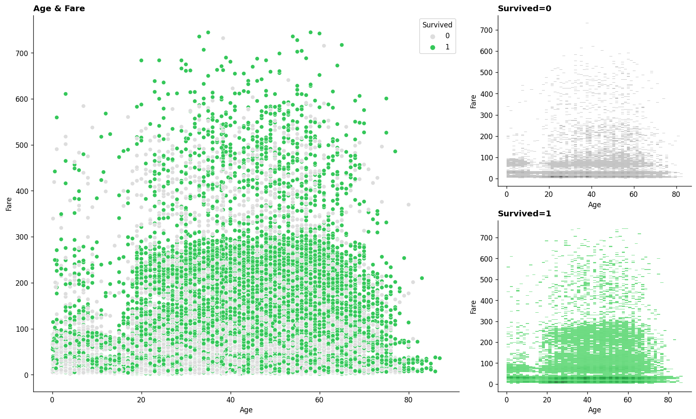
    


```python
train.info()
```

    <class 'pandas.core.frame.DataFrame'>
    RangeIndex: 100000 entries, 0 to 99999
    Data columns (total 16 columns):
     #   Column         Non-Null Count   Dtype  
    ---  ------         --------------   -----  
     0   PassengerId    100000 non-null  int64  
     1   Survived       100000 non-null  int64  
     2   Pclass         100000 non-null  int64  
     3   Name           100000 non-null  object 
     4   Sex            100000 non-null  object 
     5   Age            100000 non-null  float64
     6   SibSp          100000 non-null  int64  
     7   Parch          100000 non-null  int64  
     8   Ticket         95377 non-null   object 
     9   Fare           100000 non-null  float64
     10  Cabin          32134 non-null   object 
     11  Embarked       99750 non-null   object 
     12  Age band       96708 non-null   object 
     13  Family         100000 non-null  int64  
     14  Ticket_type    100000 non-null  object 
     15  Ticket_number  94704 non-null   float64
    dtypes: float64(3), int64(6), object(7)
    memory usage: 12.2+ MB


```python

```
